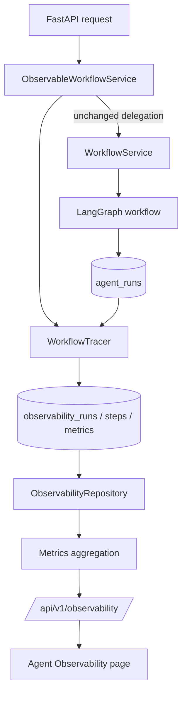

# Phase 6.6 Final Report — Agent Observability

Date: 2026-09-22
Branch: `main`
Base HEAD before this phase: `a12cd642aba264a0796c3b536d4200de6024b242`
Status at phase start: clean (`git status --porcelain` empty)
Commit: `feat: add agent observability layer`
Decision: **PASS**

## Status

**PASS.** All Phase 6.6 work packages (6.6-A through 6.6-F) are implemented and verified.
Regression is green across backend, ML, simulator, and frontend. Schema drift is clean. Backend
and frontend images build from the modified trees, and the new module and Alembic revision are
verified inside the built images.

Five items are recorded in [Deviations and open items](#deviations-and-open-items): four scope
deviations (D-1 to D-4) and one test-safety hardening (D-5). One pre-existing repository defect
was discovered and is reported, not fixed (DISC-1).

## Architecture



New module:

```text
backend/app/observability/
├── __init__.py       package contracts (no tracer import, to avoid an app.models cycle)
├── models.py         ObservabilityRun / ObservabilityStep / ObservabilityMetric + read contracts
├── tracer.py         WorkflowTracer + ObservableWorkflowService (the only integration point)
├── metrics.py        pure metric derivation (no database access)
└── repository.py     SQLAlchemy access layer for the three observability tables
```

Additional new files: `backend/app/api/observability.py`,
`backend/alembic/versions/20260922_05_phase6_6_observability.py`,
`backend/tests/test_observability.py`, `backend/tests/test_observability_integration.py`,
`frontend/src/observability.test.tsx`, `docs/AGENT_OBSERVABILITY.md`.

Modified files: `backend/app/config.py`, `backend/app/main.py`, `backend/app/models/__init__.py`,
`frontend/src/{api,types,components,pages,App,AppShell}.tsx|ts`, `frontend/src/styles.css`,
`README.md`. Total diff: 11 modified files, 8 added files.

### What was deliberately not touched

`app/workflow/graph.py`, `provider.py`, `policy.py`, `service.py`, `contracts.py`, `tools.py`,
`app/knowledge/*`, and `app/api/workflows.py` are byte-identical to the Phase 5 release. The
business chain `Diagnosis → Agent → Approval → WorkOrder` is unchanged. A regression test pins
`ObservableWorkflowService` to exactly three overridden methods (`start`, `decide_approval`,
`cancel`); every other behaviour is inherited.

## Trace

`ObservableWorkflowService` extends `WorkflowService`, calls the inherited implementation, and
passes return values and exceptions through untouched. Observability writes happen outside the
caller's transaction, and every tracing failure is logged and swallowed, so the layer cannot
break a maintenance decision.

- `start()` opens a run as `RUNNING`, then links `workflow_run_id`, materialises agent steps, and
  finalises the status.
- `decide_approval()` and `cancel()` re-synchronise and finalise the open run.
- Steps are materialised from the Phase 5 audit trail in `agent_runs`. No manual instrumentation
  and no new instrumentation call site were added; the workflow lifecycle triggers everything.
- Run statuses: `RUNNING`, `SUCCESS`, `FAILED`, `BLOCKED`, `WAITING_APPROVAL`, `CANCELLED`.
  Step statuses: `SUCCESS`, `FAILED`.
- A run that fails before a `workflow_runs` row exists is traced as `FAILED` with an empty
  `workflow_run_id`. An idempotent replay drops the provisional trace and refreshes the real one
  instead of double counting.
- Step `start_time`/`end_time` are derived from the recorded audit timestamp and the measured
  latency of the real invocation; latency is clamped at zero against clock skew.
- Summaries are bounded to 400 characters and contain identifiers, counters, and validated
  structured output only. Prompts, retrieved document text, and model reasoning are never stored.

Observed end-to-end lifecycle in the real-database test: `RUNNING` → `WAITING_APPROVAL` → (human
approval) → `SUCCESS`, with three ordered steps `triage`, `planning`, `safety_review`.

## Metrics

Recorded: run status, run latency, per-step latency, per-step status, input/output/total tokens,
request count, schema retries, and per-agent aggregates.

Derived by `GET /metrics`: `total_runs`, `runs_today`, `runs_running`, `runs_waiting_approval`,
`completed_runs`, `success_count`, `failure_count`, `blocked_count`, `cancelled_count`,
`success_rate`, `avg_latency_ms`, `p95_latency_ms`, `avg_step_latency_ms`, `step_status_counts`,
`token_usage`, and `by_agent`.

- Success rate = `success_count / completed_runs`, where completed means terminal
  (`SUCCESS`, `FAILED`, `BLOCKED`, `CANCELLED`). Open runs are excluded. The value is `null`, not
  `0`, when nothing has completed.
- Latency averages are exact SQL aggregates; p95 uses nearest-rank over the most recent 1000
  terminal runs (stable ordering, reproducible figure).
- Token totals are sums over stored steps and are `null` when no step reported usage.
  `steps_with_token_data` and `steps_total` state the coverage explicitly.

**Token honesty.** The deterministic `TestProvider` returns `ProviderUsage()` with no token
fields. The integration test asserts that all three stored metrics rows carry `NULL` tokens and
that the aggregate reports `token_usage.total_tokens = null` with `steps_with_token_data = 0`.
No token value is estimated, back-filled, or synthesised anywhere in the layer.

## API

| Endpoint | Status |
|---|---|
| `GET /api/observability/runs?limit=&status=&workflow_name=` | Implemented |
| `GET /api/observability/metrics` | Implemented |
| `GET /api/observability/runs/{run_id}` | Implemented |

The same router is mounted at `/api/v1/observability/*` to satisfy the repository-wide API
contract documented in `docs/API_CONTRACT.md`. Both prefixes are covered by tests. Unknown
`status` filters return `422`; an unknown `run_id` returns `404` with `AGENT_RUN_NOT_FOUND`.

## Frontend

New `Agent Observability` page at `/observability`, reachable from primary navigation.

- **Overview**: agent runs today, success rate, average latency (with p95), token usage (with
  reporting coverage), failed runs, runs awaiting approval.
- **Run history**: Run ID, Workflow, Status, Duration, Time. Selecting a run opens its trace.
- **Trace detail**: run header (workflow, workflow run, device, provider/model, trace ID, window,
  duration, steps) and the ordered agent step chain with latency, status, and token availability
  per step, plus a link to the authoritative workflow view.
- **Execution analysis**: per-agent steps, failures, average and p95 latency, tokens, and schema
  retries, plus the step status distribution.
- Token usage renders `Not reported` when the provider returned no usage. `Not available` is used
  for absent aggregate values. No placeholder numbers are shown.

## Tests

| Suite | Added | Total | Result |
|---|---|---|---|
| Backend unit and contract (`tests/test_observability.py`) | 43 | 43 | PASS |
| Backend real-database integration (`tests/test_observability_integration.py`) | 1 | 1 | PASS (opt-in) |
| Frontend (`src/observability.test.tsx`) | 4 | 17 | PASS |

Backend discovery: 97 tests collected. With `OBSERVABILITY_TEST_DATABASE_URL` configured, 97
passed and 0 were skipped. Without it, 96 passed and the single integration test is skipped, so
CI without PostgreSQL stays green.

Coverage of the required areas:

- **Trace**: run creation, `RUNNING` state, status finalisation for `SUCCESS` / `FAILED` /
  `BLOCKED` / `WAITING_APPROVAL`, step persistence with ordering, sequence, and tokens,
  idempotent-replay handling, approval refresh, and tracing-failure containment.
- **Metrics**: latency statistics (mean, nearest-rank percentile, per-agent), token statistics,
  success rate derivation, absent-value semantics, and step status counting.
- **API**: run history listing, detail trace with ordered steps, `404` for unknown runs, `422` for
  unknown status filters, and both URL prefixes.
- **Workflow**: the real `WorkflowService` and real graph executed against PostgreSQL in a
  throwaway database, producing observability data end to end.
- **Test safety**: the throwaway-database reset refuses any name that is not provably disposable,
  so a copied live connection string cannot cause a destructive statement. The guard is pinned by
  a test that always runs, and was confirmed to reject the live database name while still
  accepting the scratch name.

The integration test creates and drops its own database (`obs_phase66_test`) and never writes to
the live database. Because the fixture issues `DROP DATABASE`, the target name taken from the
environment is validated against an allow-list pattern before any statement runs (D-5). Verified
after the run: the throwaway database is absent and the live `observability_*` tables contain zero
rows.

## Regression

| Area | Command | Result |
|---|---|---|
| Backend tests | `pytest` | 97 passed, 0 skipped (53 passed before) |
| Backend lint | `ruff check .` | PASS |
| Backend format | `ruff format --check .` | PASS (98 files) |
| Backend types | `mypy app tests` | PASS (82 source files) |
| Agent tests | `pytest tests/test_workflow.py` | 13 passed (unchanged) |
| ML | `pytest`, ruff, ruff format, mypy | 16 passed; all PASS |
| Simulator | `pytest`, ruff, ruff format, mypy | 24 passed; all PASS |
| Frontend tests | `npm run test` | 17 passed (13 passed before) |
| Frontend lint | `npm run lint` | PASS |
| Frontend build | `npm run build` | PASS |
| Docker backend build | `docker build backend` | PASS |
| Docker frontend build | `docker build frontend` | PASS |

Additional verification:

- **Migration applied**: `alembic upgrade head` moved `20260920_04 → 20260922_05` against the
  running PostgreSQL 16 instance.
- **Schema drift**: `alembic check` reported `No new upgrade operations detected.` (PASS). This
  check caught a real defect during implementation: the observability ORM models were not
  registered in `Base.metadata`, which was corrected by exporting them from `app/models/__init__.py`.
- **Migration round trip**: `alembic downgrade -1` removed all three tables; `alembic upgrade head`
  recreated them with the expected columns, indexes, and `ON DELETE CASCADE` foreign keys.
- **Image packaging (backend)**: inside the built backend image, `Base.metadata` exposes
  `observability_metrics`, `observability_runs`, `observability_steps`, the migration file is
  present, `alembic heads` reports `20260922_05` as the single head, and the served OpenAPI schema
  lists all six observability paths on both prefixes.
- **Image packaging (frontend)**: the built frontend image serves `index.html` plus hashed assets
  whose filenames match the local `npm run build` output byte for byte, confirming the image
  contains the current build.
- **Live database integrity**: the live `industrial_ai_control_tower` database retains its 23
  public tables, and `observability_runs`, `observability_steps`, and `observability_metrics`
  contain 0 rows after all verification.

## Documentation

- `docs/AGENT_OBSERVABILITY.md` added: architecture and lifecycle Mermaid diagrams, trace model
  with field tables, status mapping table, metric definitions (run success rate, latency, token
  usage, agent step status), evaluation support, API reference with an accurate response example,
  storage and configuration, design principles, limitations, and verification commands.
- `README.md` gained exactly one sentence: "Added Agent Observability layer for workflow tracing,
  metrics collection and execution analysis." No restructuring was performed.
- Design principle emphasised in the documentation: non-invasive observation, no business logic
  change, traceability, and evaluation support.

## Git

| Item | Value |
|---|---|
| Branch | `main` |
| Base HEAD | `a12cd642aba264a0796c3b536d4200de6024b242` |
| Commit subject | `feat: add agent observability layer` |
| Commit hash | tip of `main`; read it with `git log -1 --format=%H`. The hash is not embedded here because this report is part of the commit it would describe |
| Files changed | 23 (11 modified, 12 added) |
| Diff size | roughly 3.9k insertions, 2 deletions. Stated approximately because this report is itself part of the diff, so an exact figure would be invalidated by any later edit to this file |
| Status before commit | 11 modified, 8 untracked paths staged by `git add .` |
| Status after commit | clean working tree; `git status --short` empty |
| Remote | `origin/main` still at `a12cd642`; push not performed |

`git add .` staged only the files listed above. Ignored paths (`.venv`, `node_modules`,
`frontend/dist`, `*.tsbuildinfo`, `.env.txt`, `.workbuddy/`, tool caches) remained untracked. A
filenames scan of the staged set found no `.env`, credential, token, or key material.

## Deviations and open items

**D-1 — Table naming.** The specification named the tables `agent_runs`, `agent_steps`, and
`agent_metrics`. Phase 5 already owns a table named `agent_runs` that stores per-agent audit
records, so reusing that name would have silently redefined an existing frozen artifact and
conflicted with the schema-drift guarantee. The projection is therefore namespaced as
`observability_runs`, `observability_steps`, and `observability_metrics`, with model classes
named accordingly. No existing table is altered. The specified field sets are implemented as
specified.

**D-2 — API prefix.** The specification showed `/api/observability/*`, while
`docs/API_CONTRACT.md` declares that all APIs are versioned under `/api/v1/`. Both are served by
one router: `/api/v1/observability/*` is the contract-compliant canonical path and
`/api/observability/*` is the specified shorthand. If a single path is preferred, removing one
`include_router` line in `app/main.py` is the entire change.

**D-3 — `CANCELLED` status.** The specification listed five statuses. The authoritative workflow
has a sixth terminal state for operator cancellation. It is kept as its own observability status
rather than folded into `BLOCKED`, which is reserved for deterministic safety-policy blocks.
Folding them would corrupt the meaning of the blocked counter.

**D-4 — README documentation link.** Per the instruction to change only one sentence in the
README, `docs/AGENT_OBSERVABILITY.md` was not added to the README documentation table. The
document is discoverable from the repository tree but not linked from the README. A one-row table
addition would close this; it was left out to respect the stated scope.

**D-5 — Test-safety hardening (added beyond the stated scope).** The real-database integration
fixture executes `DROP DATABASE IF EXISTS "<name>"` against the name derived from
`OBSERVABILITY_TEST_DATABASE_URL`. During the final regression pass the variable was mistakenly
pointed at the live database name. The fixture had no defence, so it issued
`DROP DATABASE "industrial_ai_control_tower"` and failed only because the running backend held two
active sessions against that database. Had no sessions been active, the live database would have
been destroyed.

A guard was therefore added: the target name must match `^[a-z][a-z0-9_]*test[a-z0-9_]*$` before
any administrative statement runs, and a clear `RuntimeError` explains how to pass a scratch
database instead. The guard is exercised by
`test_integration_fixture_refuses_to_drop_a_live_database`, which is a normal (non-skipped) test so
it runs even when PostgreSQL is absent. This was not requested by the specification; it was added
because an unguarded destructive statement in the test suite is a latent hazard, and because the
incident above proved it is reachable by a plausible mistake. Both failure modes were reproduced
after the change: the live URL is now refused before any statement executes, and the scratch URL
passes.

**DISC-1 — Pre-existing CI defect (not caused by Phase 6.6, not fixed).** The `docs` job in
`.github/workflows/ci.yml` asserts exactly 10 ADR files, while 11 are tracked:

```text
docs/adr/ADR-011.md            introduced in 0a6ed71 "feat: complete phase 4 evidence rag gate"
the adr_count -ne 10 assertion written in 6e069b9 "feat: implement phase 3 ml diagnosis engine"
```

The `docs` CI job has therefore been failing since Phase 4, independent of this phase. Phase 6.6
neither added nor removed an ADR and did not modify `ci.yml`. The fix is a one-line change
(`-ne 10` → `-ne 11`, or a `-lt 10` lower bound). It was not applied because CI configuration is
outside the Phase 6.6 scope and was not authorised. Approval is requested before touching it.

## Scope boundary

Phase 6.6 is complete and execution stops here. Phase 7, Kubernetes, deployment, and cloud
infrastructure were not started.

Phase 7: NOT_STARTED
