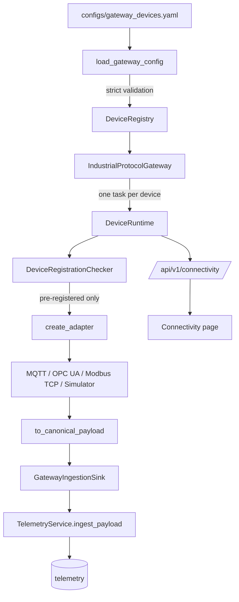

# Phase 6.7 Final Report: Industrial Protocol Gateway and Device Onboarding

Date: 2026-09-22
Branch: `main`
Base HEAD before this phase: `14c91759274d44d7a5a04e54d0373a5a86140be3` (annotated tag `v1.4.0`)
Status at phase start: clean (`git status --porcelain` empty)
Feature commit: `b74a1b969e4be4d7955bcd1323d89c495a049f8e` (`feat: add industrial protocol gateway`)
Remote CI for the feature commit: run number 9, conclusion `success`, all five jobs green
Decision: **PASS**, awaiting operator acceptance

## Status

**PASS.** Phase 6.7 promotes the Phase 6.5 protocol adapters from standalone constructs to a
gateway-managed runtime. Every work package is implemented and verified: declarative device
definitions, a strict configuration loader, a device registry, per-device runtime with bounded
backoff and failure isolation, an ingestion bridge that reuses the existing single boundary, a
connectivity REST API, and a connectivity UI page.

The feature commit is pushed to `origin/main`, which now equals local `main` at `b74a1b9`. Remote
CI on that commit completed with conclusion `success`. No tag and no release were created, per the
phase instruction. Execution stops here pending acceptance.

Three design questions were resolved with the operator before any code was written, and their
answers are binding on the implementation. They are recorded in
[Deviations and open items](#deviations-and-open-items) as D-1, D-2, and D-3.

## Architecture



New package:

```text
backend/app/gateway/
├── __init__.py           public exports
├── errors.py             GatewayError family
├── models.py             canonical signals, DeviceState, per-protocol config blocks, DeviceDefinition
├── normalizer.py         signal to contract field mapping and state resolution
├── config.py             strict YAML loader, secret detection and redaction
├── registry.py           DeviceRegistry with atomic duplicate rejection
├── ingestion.py          GatewayIngestionSink, DeviceRegistrationChecker, telemetry topic builder
├── runtime.py            RetryPolicy and DeviceRuntime
├── gateway.py            IndustrialProtocolGateway orchestration
└── simulator_source.py   lazy simulator model import for the simulator protocol
```

Additional new files: `backend/app/api/connectivity.py`,
`configs/gateway_devices.example.yaml`, `docs/INDUSTRIAL_PROTOCOL_GATEWAY.md`,
`backend/tests/gateway/` (nine files), `frontend/src/connectivity.test.tsx`.

Modified files: `backend/app/config.py`, `backend/app/main.py`, `backend/pyproject.toml`,
`backend/requirements.txt`, `backend/requirements-dev.txt`, `docs/INDUSTRIAL_PROTOCOL_ADAPTER.md`,
`README.md`, `frontend/src/{App,AppShell,api,pages,types}.tsx|ts`. Total diff: 35 files, 3549
insertions, 2 deletions.

### What was deliberately not touched

No second `UnifiedTelemetry`, no second `ProtocolType`, no second adapter registry, and no second
ingestion pipeline were introduced. `backend/app/adapters/*` is unchanged. `TelemetryIn`,
`TelemetryService`, the `telemetry` table schema, and the alarm rules remain byte-identical, and a
contract test continues to pin the field set against the simulator.

The gateway owns runtime lifecycle only. Data still flows through the one entry point that already
existed, so every downstream guarantee (topic and payload device equality, `extra=forbid`
validation, device existence) is inherited without duplication.

## Onboarding and configuration

A device is onboarded by one YAML block. The loader is deliberately unforgiving.

- `version` must equal `1`; the top level forbids unknown keys.
- Duplicate `device_id` values are rejected during load, not at first use.
- Every canonical signal must be mapped exactly once. Both a missing signal and an unknown signal
  are fatal at load time (D-1).
- The protocol block must match the declared `protocol`. A Modbus device without registers, or an
  OPC UA device without nodes, fails validation.
- Modbus holding registers are checked against the 40001 to 105536 range.

Eight canonical signals are required: `temperature`, `bearing_temperature`, `vibration`,
`current`, `voltage`, `rpm`, `load`, `power`.

`operating_state` and `fault_state` cannot be produced by any adapter, because
`UnifiedTelemetry.signals` carries floats only, and the two columns are non-null strings. They are
therefore sourced from configuration (D-2). Each device declares static labels for both, and may
additionally declare derived rules per target. Rules are evaluated in declaration order, the first
matching rule for a target wins, and a rule whose signal is absent is skipped. When no rule matches,
the static label is used. This keeps every published telemetry row honest: a device never publishes
a state string that was not either declared or derived from a measurement it actually reported.

Secrets are never exposed. The loader marks `password`, `passwd`, `secret`, `token`, `credential`,
`api_key`, `apikey`, and `private_key` as sensitive, and the redaction helper walks nested
structures before any value can reach a log line or an API response.

## Device lifecycle

Eight states are modelled: `DISABLED`, `STARTING`, `CONNECTING`, `CONNECTED`, `DEGRADED`,
`RECONNECTING`, `ERROR`, `STOPPED`.

| Transition | Trigger |
|---|---|
| `DISABLED` | Definition loaded with `enabled: false` |
| `STARTING` | `start_device` accepted, registration check pending |
| `CONNECTING` | Registration passed, adapter `connect` in flight |
| `CONNECTED` | Adapter connected, poll loop running |
| `DEGRADED` | Consecutive failures reached `failure_threshold` (3) |
| `RECONNECTING` | Consecutive failures reached `reconnect_threshold` (6) |
| `ERROR` | Reconnect budget exhausted, or permanent failure such as an unregistered device |
| `STOPPED` | Operator stop, or graceful shutdown |

Backoff is deterministic bounded exponential growth with no jitter, so the schedule is
reproducible in tests and directly observable by an operator. Defaults are
`backoff_initial_seconds = 1.0`, `factor = 2.0`, `backoff_max_seconds = 30.0`, and
`max_reconnect_attempts = 5`. All five values are configurable through `Settings`.

Failure isolation is structural. Each device runs in its own `asyncio` task with its own adapter
instance and its own failure counters, so one misbehaving device cannot degrade another. A test
drives two devices where one fails permanently and asserts the healthy device keeps polling.

Shutdown is graceful. `IndustrialProtocolGateway.stop()` cancels every device task, awaits
cancellation, and closes each adapter. `start_device` and `stop_device` are idempotent, so repeated
operator actions do not spawn duplicate tasks.

## Ingestion

`GatewayIngestionSink` is the only gateway component that writes telemetry. It normalizes the
adapter output through `to_canonical_payload`, then calls the existing
`TelemetryService.ingest_payload(topic, body)` with the topic
`industrial/devices/{device_id}/telemetry`.

The signal to contract mapping is explicit: `temperature` to `temperature_c`, `vibration` to
`vibration_mm_s`, `rpm` to `rpm` with integer rounding, and the remaining signals to their
same-named columns. A test asserts the produced body validates as `TelemetryIn` and that the topic
matches what `TelemetryService` itself expects, so the gateway cannot silently drift from the locked
contract.

`IngestionOutcome` distinguishes `PERSISTED`, `DUPLICATE`, and `REJECTED`, and a rejected ingestion
counts as a failure for the device runtime.

Registration is a hard precondition (D-3). `DeviceRegistrationChecker` verifies the device row
exists before any adapter is constructed. The gateway never creates device rows and never mutates
the devices table. A device that is not pre-registered fails permanently into `ERROR`, and a test
pins that behaviour.

MQTT keeps its existing push semantics. The gateway never polls an MQTT device and never constructs
an MQTT adapter for it; the runtime mirrors the shared consumer's connection through a
`mqtt_connected` callback, and the connectivity API disables the start and stop controls for MQTT
devices.

## API

| Endpoint | Status |
|---|---|
| `GET /api/v1/connectivity/summary` | Implemented |
| `GET /api/v1/connectivity/devices` | Implemented |
| `GET /api/v1/connectivity/devices/{device_id}` | Implemented |
| `POST /api/v1/connectivity/devices/{device_id}/start` | Implemented |
| `POST /api/v1/connectivity/devices/{device_id}/stop` | Implemented |

The router is mounted at both `/api/v1/connectivity` and `/api/connectivity`, matching the
repository-wide dual-prefix convention. When the gateway is disabled, every endpoint returns `503`
with `CONNECTIVITY_DISABLED`. An unknown device id returns `404` with
`CONNECTIVITY_DEVICE_NOT_FOUND`. A configuration failure at startup is surfaced through the
`gateway_error` field on the summary rather than by failing the application, so a bad device file
cannot take down the rest of the platform.

`/ready` now includes a `connectivity` dependency that reports `available` or `disabled`.

## Frontend

A new `Connectivity` page at `/connectivity`, reachable from primary navigation, with a dependency
badge in the shell.

- Gateway availability and an aggregate device count by lifecycle state.
- A device table showing protocol, endpoint, state, last error, and last poll time.
- Start and stop controls per device, disabled for MQTT devices and for disabled definitions.
- React Query mutations invalidate the summary and device queries so state refreshes without a
  manual reload.

## Tests

| Suite | Added | Result |
|---|---|---|
| `tests/gateway/test_models.py` | included in the 98 below | PASS |
| `tests/gateway/test_config.py` | included in the 98 below | PASS |
| `tests/gateway/test_registry.py` | included in the 98 below | PASS |
| `tests/gateway/test_normalizer.py` | included in the 98 below | PASS |
| `tests/gateway/test_runtime.py` | included in the 98 below | PASS |
| `tests/gateway/test_gateway.py` | included in the 98 below | PASS |
| `tests/gateway/test_connectivity_api.py` | included in the 98 below | PASS |
| Gateway package total (`pytest tests/gateway`) | 98 | PASS |
| Frontend (`src/connectivity.test.tsx`) | 5 of 22 | PASS |

Coverage of the required areas:

- **Models and coverage**: all eight signals accepted; a missing signal rejected; an unknown signal
  rejected; per-protocol block and protocol mismatch rejected; Modbus register range enforced.
- **Normalization**: every signal maps to the correct contract field; `rpm` integer coercion;
  produced body validates as `TelemetryIn`; topic matches the ingestion consumer; static state
  labels; derived rules with first-match-wins; absent-signal rule skipped.
- **Config**: missing file, empty file, malformed YAML, wrong version, duplicate device id, and
  partial coverage all raise `GatewayConfigurationError`; secret keys redacted recursively.
- **Registry**: registration, atomic duplicate rejection, lookup, listing, enabled filtering.
- **Runtime**: state transitions across the eight states; backoff is bounded and exponential;
  reconnect exhaustion ends in `ERROR`; an unregistered device fails permanently; failure isolation
  between two devices; idempotent start and stop; graceful shutdown cancels tasks.
- **API**: summary, listing, single device, start, stop, `404` for unknown device, `503` when
  disabled, and both URL prefixes.
- **Frontend**: summary rendering, device table, start and stop mutations, MQTT controls disabled.

## Regression

All commands were run locally against the real trees, and reconfirmed immediately before the
feature commit.

| Area | Command | Result |
|---|---|---|
| Backend tests | `pytest` | 194 passed, 1 skipped |
| Backend lint | `ruff check .` | PASS |
| Backend format | `ruff format --check .` | PASS (118 files) |
| Backend types | `mypy app tests` | PASS (102 source files) |
| Simulator | `pytest`, ruff, ruff format, mypy | 24 passed; all PASS (23 source files) |
| ML | `pytest`, ruff, ruff format, mypy | 16 passed; all PASS (10 source files) |
| Frontend tests | `vitest run` | 22 passed (7 files) |
| Frontend lint | `eslint .` | PASS |
| Frontend types | `tsc --noEmit` | PASS |
| Frontend build | `vite build` | PASS |
| Migration state | `alembic current` | `20260922_05 (head)` |
| Schema drift | `alembic check` | `No new upgrade operations detected.` |

The backend skip is the pre-existing opt-in integration test that requires a dedicated database
URL, unchanged by this phase. No migration was added in Phase 6.7, which is why `alembic check`
reports no new operations.

### Remote CI

The push to `origin/main` triggered workflow run number 9 on commit `b74a1b9`. All five jobs
completed successfully: `backend`, `frontend`, `simulator`, `ml`, and `docs`. The `docs` job
passing confirms that the pre-existing ADR count defect reported as DISC-1 in Phase 6.6 has since
been fixed in the workflow (`ADR_MIN_COUNT=11` with a lower-bound comparison).

### Environment notes

Two local environment facts are recorded for reproducibility and are not repository defects.
`backend/.venv` and `simulator/.venv` are empty stubs, so the backend, simulator, and ML checks were
run with the root `.venv`, which carries the required dependencies. During the regression pass a
single transient `mypy` internal error was observed on the simulator job; the identical command
immediately reran to `Success: no issues found in 23 source files`, which identifies it as a cache
race rather than a code fault.

## Documentation

- `docs/INDUSTRIAL_PROTOCOL_GATEWAY.md` added: architecture diagram, the reason full signal coverage
  is mandatory, the reason state values come from configuration, the lifecycle table, failure
  isolation, graceful shutdown, MQTT passthrough, the API reference, secrets handling, the
  configuration reference, six stated limitations, and verification commands.
- `docs/INDUSTRIAL_PROTOCOL_ADAPTER.md` gained a "Runtime ownership" section that names the gateway
  as the runtime owner the adapter boundary anticipated, and that confirms MQTT is never polled.
- `README.md` gained one documentation table row linking the new gateway document.
- `configs/gateway_devices.example.yaml` documents four credential-free examples covering all four
  protocols, including one derived-state rule per derived target.

## Git

| Item | Value |
|---|---|
| Branch | `main` |
| Base HEAD | `14c91759274d44d7a5a04e54d0373a5a86140be3` |
| Feature commit subject | `feat: add industrial protocol gateway` |
| Feature commit hash | `b74a1b969e4be4d7955bcd1323d89c495a049f8e` |
| Files changed | 35 (13 modified, 22 added) |
| Diff size | 3549 insertions, 2 deletions |
| Status after commit | clean working tree; `git status --short` empty |
| Remote | `origin/main` updated `14c9175..b74a1b9`; `git ls-remote` confirms `b74a1b9` |
| Tag | none created; no tag points at HEAD; latest tag remains `v1.4.0` |
| Release | none created, per the phase instruction to wait for acceptance |

A credential scan of the new files found no `.env`, token, key, or credential material, and no
`kaggle` reference. `git diff --check` reported clean, with only the usual CRLF normalization
warnings on files whose committed form is LF.

## Deviations and open items

**D-1: Full signal coverage is mandatory (operator decision).** The canonical contract requires all
eight numeric signals because every `telemetry` column is non-null. A device definition that maps
fewer signals cannot be published without fabricating values, which is forbidden. The loader
therefore rejects partial coverage, and no default, constant, or zero-filled signal is ever
substituted. The example configuration maps all eight signals for every polled device.

**D-2: State fields come from configuration (operator decision).** `operating_state` and
`fault_state` are non-null strings, while `UnifiedTelemetry.signals` carries floats only, so no
adapter can produce them. Both a static declaration and derived rules are supported. The static
labels are always required so a device always has an honest value, and rules only ever refine that
value from measurements the device actually reported.

**D-3: Pre-registration only (operator decision).** The gateway validates that a device row exists
and fails the device permanently when it does not. It never creates device rows. This preserves the
existing ingestion invariant that an unknown device is rejected, and it keeps device identity under
explicit operator control.

**D-4: MQTT remains passive.** MQTT devices are listed and status-tracked but never polled, because
the existing consumer owns the push connection. The connectivity API disables mutation controls for
MQTT devices rather than offering a start button that would have no effect.

**O-1: Multi-instance coordination is out of scope.** The gateway assumes a single application
process owns a given device. Two instances loading the same device file would both poll it. This is
documented as a limitation and matches the current single-process deployment. Operator acceptance is
requested before any change here.

**O-2: No gateway-managed schema change.** Phase 6.7 adds no table and no migration. Device
definitions live in YAML, and runtime state is in memory. Persisting lifecycle history would be a
new capability and was not in scope.

## Scope boundary

Phase 6.7 is complete, pushed, and verified by remote CI. Execution stops here and awaits operator
acceptance. No release was published for this phase.

Phase 7: NOT_STARTED
