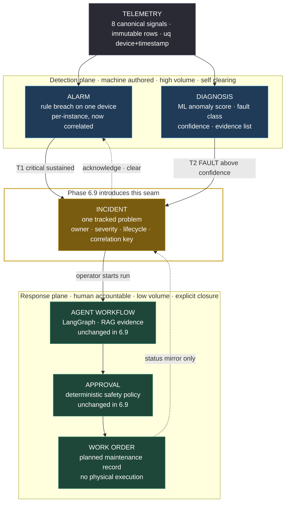
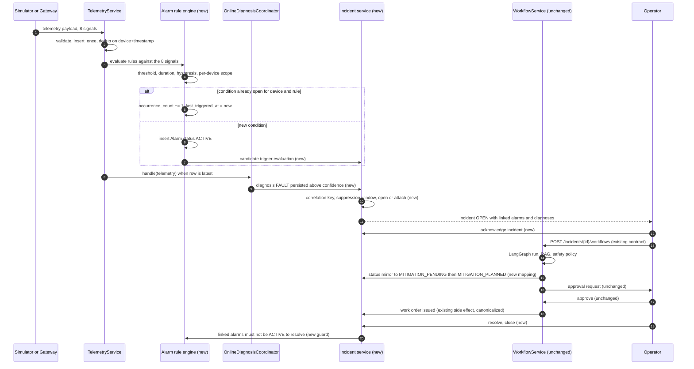
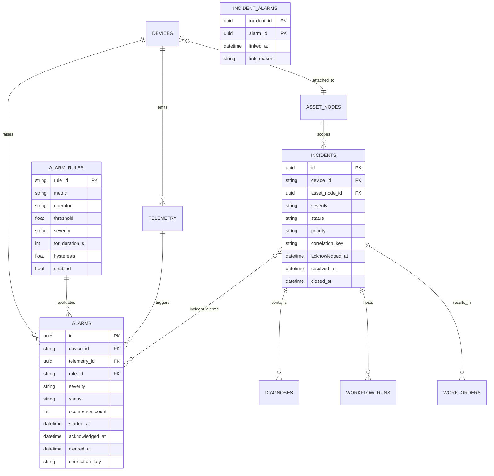
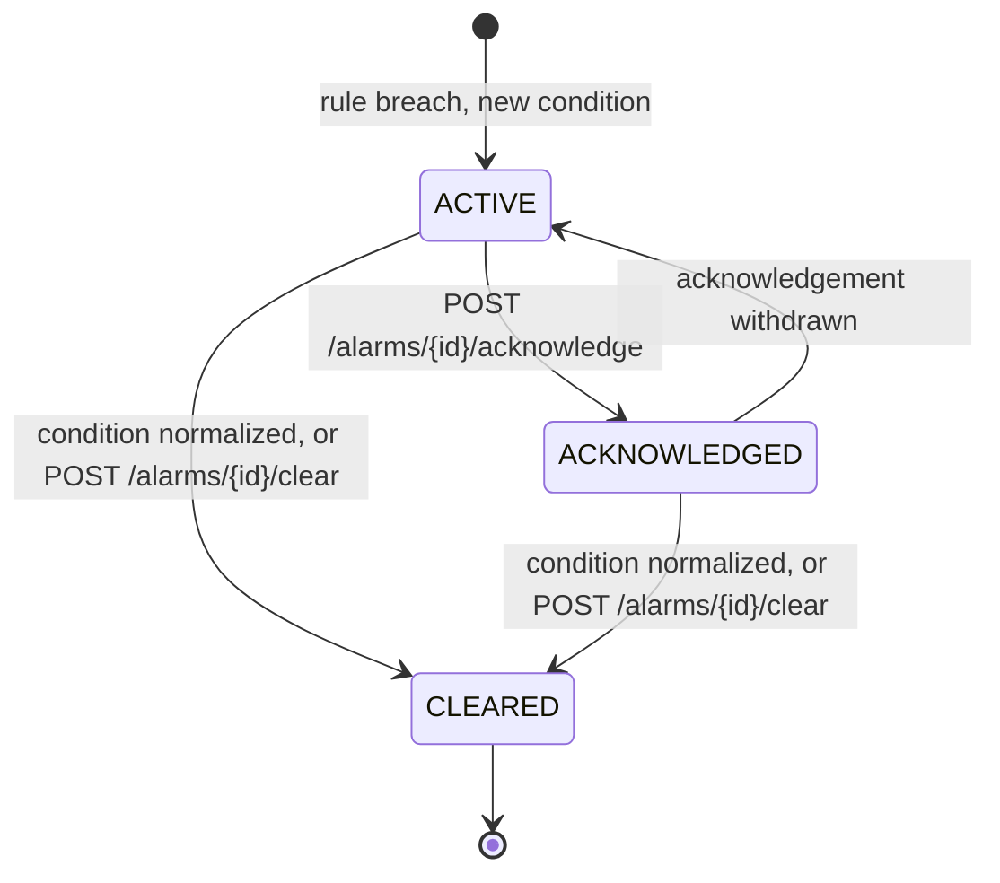
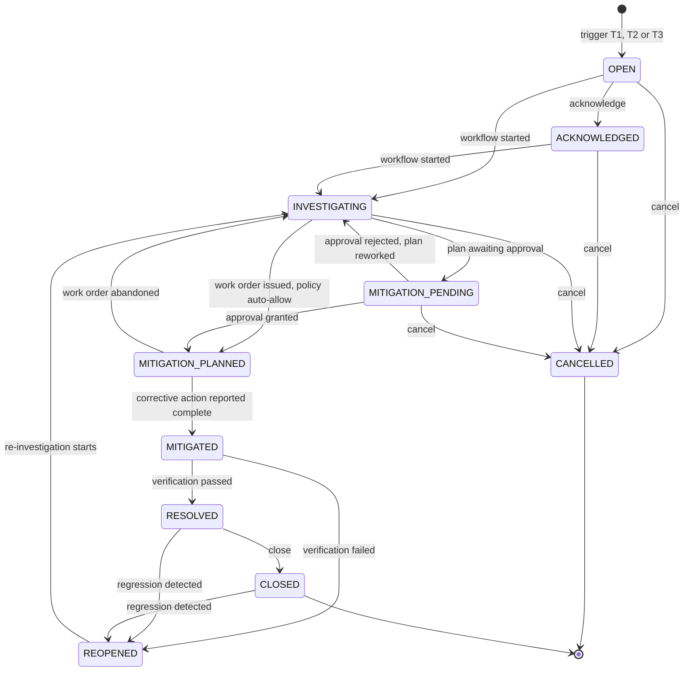

# Phase 6.9 Architecture Design Report: Incident and Alarm Management

## 0. Status

**DESIGN ONLY. Awaiting approval.** This phase produced an architecture design report and nothing else.
No implementation code, no migration, no commit, no push, no tag, and no release were created. The
working tree contains exactly one new untracked file, this report.

| Item | Value |
|---|---|
| Phase | 6.9 Incident and Alarm Management, architecture audit and design planning |
| Baseline release | `v1.6.0` (Phase 6.8, Asset and Device Configuration Management) |
| Branch | `main` |
| HEAD | `2c2f216a34885efc4a12736dc18fc6d4aab80078` |
| `git describe --tags --exact-match HEAD` | `v1.6.0` |
| Working tree | Clean before this report; one untracked document added |
| Current Alembic head | `20260922_06` (Phase 6.8) |
| Deliverable | This report |
| Code, migration, commit, push, tag, release | None |

### 0.1 The single most important audit finding

The most consequential finding of this audit is that **Phase 6.9 is an extension, a formalization, and a gap-filling exercise rather than a greenfield construction.**

Two of the three entities the phase brief treats as new already exist in the live schema and in the live request path.

| Entity | Introduced | Current production consumers |
|---|---|---|
| `alarms` | Phase 2, revision `20260917_01` | Written by `TelemetryService._apply_alarm_rules`, read by `GET /api/v1/alarms`, rendered on the dashboard |
| `incidents` | Phase 2, extended Phase 5 in `20260920_04` | Created by `POST /api/v1/incidents`, mutated by `WorkflowService`, listed and detailed in the UI |
| `diagnoses` | Phase 3, extended Phase 5 | Already carries anomaly score, fault class, confidence, severity, and an evidence list |

The live pipeline does not run `Telemetry → Diagnosis → Agent`. It runs:

```text
Telemetry → Alarm(rule engine) → Diagnosis(online ML) → Incident(created from a Diagnosis)
          → WorkflowRun(LangGraph) → Approval → WorkOrder
```

Any design that introduces `incident_alarm`, `alarm_events_v2`, `incident_diagnosis`, or a second incident table would create a duplicate entity system and violate the phase's non-negotiable constraints. The design below therefore does not add a single new top-level entity. It adds one rule registry, one junction table, and a set of status and lifecycle fields on tables that already exist.

---

## 1. Current Architecture Audit

Every claim in this section was verified by reading the cited file at HEAD `2c2f216`. Line numbers refer to that revision.

### 1.1 The existing detection path

| Stage | Location | Behavior |
|---|---|---|
| Ingestion boundary | `backend/app/services/telemetry.py:60` `ingest_payload` | Single entry point. Validates, rejects, deduplicates, persists |
| Validation | `backend/app/schemas/telemetry.py` `TelemetryIn` | `extra="forbid"`, eight canonical signals |
| Duplicate suppression | `telemetry.insert_once` via `uq_telemetry_device_timestamp` | Returns `None` on a duplicate timestamp, caller rolls back |
| Alarm evaluation | `backend/app/services/telemetry.py:133` `_apply_alarm_rules` | Called at line 88, before `session.commit()` at line 89 |
| Diagnosis windowing | `backend/app/services/diagnosis.py` `OnlineDiagnosisCoordinator` | Bounded per-device buffer, stride-based window, `asyncio.to_thread` inference |
| WebSocket fan-out | `_publish_latest` at `telemetry.py:122` | Broadcasts only when the row is confirmed latest |

The alarm rule engine is eleven lines and hardcodes two rules.

```python
# backend/app/services/telemetry.py:133
if data.temperature_c > 90:
    rules.append(("HIGH_TEMPERATURE", "CRITICAL", "Temperature exceeds 90 °C."))
if data.vibration_mm_s > 7:
    rules.append(("HIGH_VIBRATION", "WARNING", "Vibration exceeds 7 mm/s RMS."))
```

There is no configuration source, no per-device scope, no duration requirement, and no hysteresis. A single sample above the threshold fires. A condition sustained for one hour fires on every telemetry row that is not a timestamp duplicate.

### 1.2 Existing data model, verified field by field

**`alarms`** (`backend/app/models/entities.py:84-99`)

| Column | Type | Notes |
|---|---|---|
| `id` | UUID PK | |
| `device_id` | String FK `devices.device_id` | NOT NULL |
| `telemetry_id` | UUID FK `telemetry.id` | Nullable |
| `rule_id` | String(100) | NOT NULL, free-form string |
| `severity` | String(20) | NOT NULL, values in practice `CRITICAL`, `WARNING` |
| `status` | String(30) | DEFAULT `'ACTIVE'`. No code path writes any other value |
| `message` | Text | NOT NULL |
| `started_at` | DateTimeTZ | DEFAULT `utc_now` |
| `cleared_at` | DateTimeTZ | Nullable. **No code path ever writes this column** |
| Constraint | `uq_alarm_telemetry_rule` | UNIQUE(`telemetry_id`, `rule_id`) |
| Index | `ix_alarm_device_started` | (`device_id`, `started_at`) |

Two structural consequences follow directly from the constraint. The unique key is scoped to one telemetry row, so the table behaves as a per-sample event log. `cleared_at` is present in the schema but unreachable in code, which means the clear concept was anticipated in Phase 2 and never implemented.

**`incidents`** (`backend/app/models/entities.py:102-109`)

| Column | Type | Notes |
|---|---|---|
| `id` | UUID PK | |
| `device_id` | String FK `devices.device_id` | Nullable, indexed |
| `title` | String(200) | NOT NULL |
| `description` | Text | DEFAULT `''` |
| `status` | String(30) | DEFAULT `'OPEN'`. Values written elsewhere: `UNDER_ANALYSIS`, `ACTION_PENDING`, `WORK_ORDER_CREATED` |
| `priority` | String(20) | DEFAULT `'MEDIUM'` |
| `created_at`, `updated_at` | DateTimeTZ | From `TimestampMixin` |

Absent fields that an operational incident record requires: `severity`, `acknowledged_at`, `acknowledged_by`, `resolved_at`, `resolved_by`, `resolution`, `closed_at`, `cancelled_at`, `cancel_reason`, `correlation_key`, `asset_node_id`.

**`diagnoses`** (`backend/app/models/entities.py:112-129`) already carries `status` (`DRAFT`/`FAULT`/`UNCERTAIN`/`NORMAL`), `fault_type`, `anomaly_score`, `confidence`, `severity`, `evidence` (JSONB list), `model_version`, `feature_version`, `trace_id`, and `incident_id` FK. This is the anomaly detection result, the fault classification, and the evidence reference the brief asks about. A second `incident_diagnosis` table would be pure duplication.

**Existing linkage, all already in place**

| Link | Location | Cardinality |
|---|---|---|
| `diagnoses.incident_id` | `entities.py:116` | many diagnoses to one incident |
| `work_orders.incident_id` | `entities.py:179` | many work orders to one incident |
| `workflow_runs.incident_id` | `entities.py:219` | NOT NULL, many runs to one incident |
| `ix_workflow_runs_incident_status` | `entities.py:215` | (`incident_id`, `status`) |

### 1.3 Where incident status is written today

Incident status is mutated from four locations with no transition guard and no shared enum.

| Location | Value written | Trigger |
|---|---|---|
| `backend/app/api/workflows.py:157` | `OPEN` | `POST /api/v1/incidents` creates the row |
| `backend/app/workflow/service.py:350` | `UNDER_ANALYSIS` | A workflow run is created for the incident |
| `backend/app/workflow/service.py:450` | `ACTION_PENDING` | Workflow reached `WAITING_APPROVAL` |
| `backend/app/workflow/service.py:452`, `:554` | `WORK_ORDER_CREATED` | Approval granted, work order issued |

`WorkflowStatus` in `backend/app/workflow/contracts.py:13` is a proper `StrEnum` with fifteen values. `Incident.status` is a bare `String(30)`. The agent execution lifecycle is enumerated and guarded; the incident lifecycle is a set of string literals scattered across two modules. That asymmetry is the core of the problem definition in section 2.

### 1.4 Existing API surface

| Method | Path | Module | Notes |
|---|---|---|---|
| `GET` | `/api/v1/alarms` | `backend/app/api/alarms.py:15` | Filters `device_id`, `limit`. Read-only |
| `POST` | `/api/v1/incidents` | `backend/app/api/workflows.py:138` | Requires `diagnosis_id`. Links `diagnosis.incident_id` |
| `GET` | `/api/v1/incidents` | `backend/app/api/workflows.py:173` | Filters `status`, `limit` |
| `GET` | `/api/v1/incidents/{id}` | `backend/app/api/workflows.py:186` | Embeds the latest diagnosis |
| `POST` | `/api/v1/incidents/{id}/workflows` | `backend/app/api/workflows.py:223` | Starts the agent workflow |
| `POST` | `/api/v1/approvals/{id}/approve` and `/reject` | `backend/app/api/workflows.py:292`, `:302` | Require the `X-Development-Actor` header |

Three observations matter for the design.

The alarm router is registered at `backend/app/main.py:324` with a single `include_router(alarms.router)` call, and the router itself declares `prefix="/api/v1/alarms"`. Phase 6.6 and 6.8 modules (observability, connectivity, assets, configurations) are registered twice with `/api/v1` and `/api` prefixes and declare no internal prefix. `alarms.py` is the only router that breaks the dual-prefix convention.

There is no command endpoint on alarms at all. There is no status-transition endpoint on incidents; the only path that changes incident status incidentally is starting or approving a workflow.

Actor identity already has an established convention. `_decide` at `workflows.py:281` raises `ACTOR_REQUIRED` with status 422 when the `X-Development-Actor` header is missing. Phase 6.9 should reuse it rather than invent a second identity mechanism.

### 1.5 Observability schema, and the constraint on it

`backend/app/observability/models.py` defines `observability_runs` (FK `workflow_run_id`), `observability_steps` (FK `run_id`, plus `source_agent_run_id`), and `observability_metrics`. There is no incident column and none is permitted.

Reachability already exists without any schema change.

```text
incidents.id
  → workflow_runs.incident_id        (entities.py:219, NOT NULL, many-to-one)
    → observability_runs.workflow_run_id
      → observability_steps.run_id
```

Answer to Q9 is therefore negative on schema change and positive on a read-only projection. Detail in section 8.3.

### 1.6 Frontend surface

| File | Current state |
|---|---|
| `frontend/src/App.tsx:43-44` | Routes `/incidents` and `/incidents/:incidentId` exist |
| `frontend/src/api.ts:84-88` | `alarms`, `incidents`, `incident` clients exist. No command clients |
| `frontend/src/types.ts` | `Alarm`, `IncidentSummary`, `IncidentDetail` typed |
| `frontend/src/pages.tsx:104` | Dashboard "Active alarms" panel filters `status === 'ACTIVE'` |
| `frontend/src/pages.tsx:104` | Panel text already reads `Alarm ≠ Diagnosis`. The distinction was deliberately surfaced to users in an earlier phase |
| `frontend/src/pages.tsx:117-121` | `IncidentsPage` status filter offers exactly `ALL`, `OPEN`, `UNDER_ANALYSIS`, `ACTION_PENDING`, `WORK_ORDER_CREATED` |
| `frontend/src/pages.tsx:123-127` | `IncidentDetailPage` renders header, diagnosis, sensor evidence, knowledge evidence, workflow, approval link, work order link. No lifecycle actions |

There is no alarm center page and no acknowledge or clear affordance anywhere in the UI.

### 1.7 What the audit actually reveals

The existing system detects well and responds well, and it has no seam between the two.

Detection is rule-based and immediate, augmented by an online ML model that publishes a scored diagnosis with an evidence list. Response is a genuine multi-agent workflow with a deterministic safety policy, an approval gate, and a work order artifact. Between them sits a manually created incident that requires a human or an external caller to already know a diagnosis identifier, and an alarm table that accumulates unbounded per-sample rows that nothing consumes.

The system can tell an operator that temperature exceeded 90 °C four hundred times. It cannot tell anyone that this is one problem, that it has been open for six hours, that nobody has acknowledged it, or that it is the same physical condition the ML model scored at 0.87.

---

## 2. Problem Definition

### 2.1 The missing seam, stated precisely

The platform has a **detection plane** and a **response plane**, and the boundary between them is undefined.

| Property | Detection plane | Response plane |
|---|---|---|
| Members | Telemetry, Alarm, Diagnosis | Incident, WorkflowRun, Approval, WorkOrder |
| Volume | High, one row per sample per rule | Low, one row per tracked problem |
| Author | Machine, deterministic, no judgment | Human-accountable, with an explicit decision point |
| Lifetime | Seconds to hours, self-clearing | Days, cleared only by an explicit act |
| Cardinality | Unbounded per condition | Bounded per condition and per window |
| Failure mode if wrong | Missing or noisy signal | Wrong action authorized, or work invisible |

The current implementation has no artifact that performs the crossing. `POST /api/v1/incidents` exists, and it demands a `diagnosis_id`, which means the crossing is manual and diagnosis-dependent. An alarm cannot cross on its own. A diagnosis can cross only if someone calls the endpoint. Nothing correlates.

This is the problem Phase 6.9 exists to solve. The absence of the seam produces five concrete, observable failures.

**F1. Alarm rows are per-sample, so an active condition has no identity.** A sustained overheat emits one row per telemetry sample. `uq_alarm_telemetry_rule` ensures uniqueness within a single sample, which prevents duplicate rules on one row and does nothing to prevent one row per sample. The dashboard slices the first ten `ACTIVE` alarms from a two-hundred-row fetch, so a single condition can occupy the entire panel and hide every other device.

**F2. No alarm can be acknowledged or cleared.** The `status` column supports the concept and only ever holds `ACTIVE`. `cleared_at` is never written. An operator has no way to say "I have seen this" or "this is back to normal." Every alarm is permanently active until a human reads it and mentally discards it.

**F3. Rules cannot be changed without a redeploy.** Two thresholds are string literals. Adding a bearing temperature rule, changing 90 to 85, disabling a rule for one device type, or requiring the condition to persist for sixty seconds all require editing Python and shipping a release.

**F4. Incident lifecycle is unguarded and implicitly owned by the agent workflow.** Four modules write five status literals. There is no table of legal transitions, so `CLOSED` to `OPEN`, `WORK_ORDER_CREATED` to `OPEN`, and any other imaginable reversal are all structurally permitted. More seriously, the incident's operator-facing status is a side effect of agent execution. An operator asking "is this incident resolved" receives an answer that depends on where a LangGraph run happens to be, and there is no field that distinguishes "the plan is waiting for approval" from "the problem is gone."

**F5. There is no correlation, so there is no unit of work.** A bearing failure typically manifests as rising vibration, then rising bearing temperature, then elevated current. The current system produces three unrelated alarm streams plus one diagnosis. Nothing bundles them. An operator triaging a hundred active alarm rows cannot tell which twenty belong to one failing machine.

### 2.2 What the phase must not become

Stated as explicit anti-goals, because each is an attractive and wrong direction.

| Anti-goal | Why it is wrong here |
|---|---|
| Create `alarm_events_v2`, `incident_v2`, or a parallel incident service | Violates the no-second-entity-system constraint and forks the source of truth |
| Create `incident_diagnosis` | `diagnoses.incident_id` already expresses the relation |
| Build a new alarm detection engine beside `_apply_alarm_rules` | Two engines would produce two alarm streams for one condition. The existing engine is promoted, not replaced |
| Make every alarm invoke the LLM | Unbounded model cost and unbounded approval-queue pressure, and it deletes the deliberate human decision point Phase 5 established |
| Write PLC, Modbus, or OPC UA commands from the incident layer | Autonomous control is prohibited across the platform |
| Add columns to `observability_*` | Constraint. Use the existing join path |
| Rewrite historical Alembic revisions | Constraint. Additive migration only |
| Model `BLOCKED` as an incident status | See Q3 in section 5.4 for the argument against |

### 2.3 Success criteria for the design

The design is adequate when all of the following hold, each of which is testable.

1. A sustained threshold breach produces exactly one open alarm row per (device, rule), with an occurrence count, not one row per sample.
2. An operator can acknowledge and clear an alarm through the API with attribution recorded.
3. Alarm rules are declarative data, and changing a threshold requires no code change and no redeploy.
4. Every incident status change passes through one guarded transition table, and an illegal transition returns a 409 with a stable error code.
5. A critical sustained alarm, or a corroborated `FAULT` diagnosis, opens an incident automatically, without human intervention and without invoking a model.
6. Multiple alarms on one device inside one window attach to one incident rather than opening several.
7. The incident timeline is reconstructable from persisted records alone.
8. Incident to agent trace is reachable without altering the observability schema.
9. No existing API contract changes meaning. Existing clients keep working.
10. ML model, frozen evaluation, RAG evaluation, LangGraph workflow, safety policy, approval semantics, and work order semantics are byte-identical to `v1.6.0`.

---

## 3. Recommended Architecture

### 3.1 The recommended layering

The brief's requested diagram, `Telemetry ↓ Alarm ↓ Incident ↓ Diagnosis ↓ Agent ↓ WorkOrder`, encodes a linear causal chain. It is a good first approximation and it needs one correction, which is the substantive architectural point.

Alarm and Diagnosis are siblings, not parent and child. Both consume telemetry. Both are machine authors. Both belong to the detection plane. Placing Diagnosis below Incident asserts that an incident causes a diagnosis, which inverts the live data flow, since `POST /api/v1/incidents` requires a diagnosis to already exist.

The corrected view keeps the requested top-to-bottom reading order and regroups the planes.



Two properties of this diagram carry the design.

The seam is a single new component. Everything that already works is unchanged and sits in one of the three boxes around it. Phase 6.9's implementation surface is the incident box plus the alarm lifecycle fields on the alarm box.

The arrow from `INCIDENT` back to `ALARM` is the acknowledge and clear path. This direction is what a purely event-sourced alarm log cannot express, and it is the reason the alarm table must move from per-sample log semantics to per-instance registry semantics.

### 3.2 Runtime sequence with the new components marked



The two asynchronous crossings, alarm to incident and diagnosis to incident, are the new code. The middle band is untouched.

### 3.3 Module placement

The recommended placement follows the `app/assetconfig/` precedent from Phase 6.8, which consolidated eleven modules for one bounded context, and it deliberately leaves three small existing files in place.

| Module | New or modified | Responsibility |
|---|---|---|
| `backend/app/incidents/__init__.py` | New | Package surface |
| `backend/app/incidents/contracts.py` | New | Pydantic request and response models |
| `backend/app/incidents/errors.py` | New | Error classes carrying stable codes and HTTP statuses, patterned on `app/assetconfig/errors.py` |
| `backend/app/incidents/states.py` | New | `AlarmStatus`, `IncidentStatus`, `Severity`, `LEGACY_ALIASES`, `INCIDENT_TRANSITIONS`, `ALARM_TRANSITIONS` |
| `backend/app/incidents/rules.py` | New | Declarative rule registry loader and pure evaluator |
| `backend/app/incidents/correlation.py` | New | Deterministic correlation key computation and window bucketing |
| `backend/app/incidents/triggers.py` | New | Pure `should_open_incident` decision function |
| `backend/app/incidents/repository.py` | New | `IncidentRepository`, `IncidentAlarmRepository`, `AlarmRuleRepository` |
| `backend/app/incidents/service.py` | New | `IncidentService` lifecycle commands, `AlarmService` acknowledgement and clearing |
| `backend/app/incidents/api.py` | New | Incident and alarm command routes |
| `backend/app/models/entities.py` | Modified, additive | New columns on `Alarm` and `Incident`, new `AlarmRule` and `IncidentAlarm` classes, constraint replacement |
| `backend/app/services/telemetry.py` | Modified | Replace the two hardcoded rules with a call into `rules.py`, preserving the existing audit action and transaction position |
| `backend/app/api/alarms.py` | Modified in place | Add filters and the two command routes. The module is twenty-three lines and moving it is pure churn |
| `backend/app/main.py` | Modified | Register the incidents router with dual prefix, align the alarms router to the dual-prefix convention |
| `backend/app/workflow/service.py` | **Not modified** | Legacy literals are absorbed by a model-level validator. See section 5.5 |

The decision to leave `app/api/alarms.py`, `app/repositories/alarm.py`, and `app/schemas/alarm.py` where they are is a deliberate minimal-footprint choice, and it carries a cost that should be acknowledged. Alarm code then lives in two locations, and a future refactor should consolidate into `app/incidents/` or a dedicated `app/alarms/` package. Consolidation is deferred because file moves inflate the diff, complicate review of the migration, and provide no behavior change. The cost is navigation, and navigation is cheap relative to migration risk.

### 3.4 Naming decision on the two planes

The package is named `app/incidents/` and holds alarm lifecycle code as well. The alternative, two packages named `app/incidents/` and `app/alarms/`, was rejected because they share one migration, one release unit, one transition vocabulary, and one correlation implementation. Splitting them would place `correlation.py` and `states.py` in an arbitrary home and force a cross-package import for every incident command that validates an alarm. One bounded context, one package.

---

## 4. Data Model Proposal

### 4.1 Design principles

Additive only. No historical revision is edited. No row is deleted by any migration. Every new column on an existing table is nullable or carries a server default, so the migration applies to a populated database without a rewrite of existing rows beyond the deliberate, documented backfills below.

### 4.2 New table `alarm_rules`

Promotes two hardcoded thresholds into declarative data. `rule_id` is a natural key that matches the existing free-form `alarms.rule_id` values, so historical rows resolve to rules without a mapping step.

| Column | Type | Constraint | Purpose |
|---|---|---|---|
| `rule_id` | String(100) | PK | Natural key. Matches existing values `HIGH_TEMPERATURE`, `HIGH_VIBRATION` |
| `name` | String(200) | NOT NULL | Human label |
| `metric` | String(50) | NOT NULL, CHECK in the eight canonical signals | Which signal the rule reads |
| `operator` | String(10) | NOT NULL, CHECK in `GT`, `GTE`, `LT`, `LTE`, `EQ`, `NE` | Comparison |
| `threshold` | Float | NOT NULL | Comparison value |
| `severity` | String(20) | NOT NULL, CHECK in the canonical severity enum | Severity assigned on breach |
| `for_duration_s` | Integer | NOT NULL DEFAULT 0, CHECK `>= 0` | Condition must hold this long before firing. Zero preserves current behavior |
| `hysteresis` | Float | NOT NULL DEFAULT 0, CHECK `>= 0` | Clear band, prevents flapping |
| `device_scope` | String(100) | Nullable FK `devices.device_id` | Rule applies to one device only when set |
| `device_type_scope` | String(50) | Nullable | Rule applies to one device type when set |
| `enabled` | Boolean | NOT NULL DEFAULT true | Disable without deleting |
| `message_template` | Text | NOT NULL | Rendered message with `{metric}` and `{value}` placeholders |
| `rule_version` | String(20) | NOT NULL DEFAULT `'1'` | Rule revision, supports auditable rule change |
| `created_at`, `updated_at` | DateTimeTZ | | From `TimestampMixin` |

Scope resolution, in order: a device-scoped rule applies only to that device; a type-scoped rule applies to all devices of that type; an unscoped rule is global. A device-scoped rule takes precedence over a type-scoped rule with the same `rule_id`. Two rules with the same `rule_id` and different scopes coexist because `rule_id` alone is the primary key only for the global definition. To keep the primary key simple and avoid a composite key migration, the recommendation is one row per `rule_id`, with the two scope columns expressing applicability. Multiple rules per metric are expressed by distinct `rule_id` values such as `HIGH_TEMPERATURE` and `HIGH_TEMPERATURE_BEARING`.

### 4.3 Modified table `alarms`, from event log to instance registry

This is the highest-risk change in the phase because it alters the meaning of an existing table. The change is justified and the reasoning is recorded in section 9.1.

Added columns:

| Column | Type | Default | Purpose |
|---|---|---|---|
| `acknowledged_at` | DateTimeTZ | NULL | When an operator acknowledged |
| `acknowledged_by` | String(100) | NULL | Who acknowledged, from `X-Development-Actor` |
| `clear_reason` | Text | NULL | Why it cleared, operator note or system reason |
| `occurrence_count` | Integer | 1, NOT NULL | How many breach samples this instance represents |
| `last_triggered_at` | DateTimeTZ | NULL | Most recent breach sample |
| `source` | String(20) | `'RULE'`, NOT NULL | `RULE`, `MANUAL`, `DIAGNOSIS` |
| `correlation_key` | String(120) | NULL, indexed | Computed window bucket, see section 4.6 |
| `rule_version` | String(20) | NULL | Rule revision that fired, for replay accuracy |

Constraint change:

```text
DROP:     uq_alarm_telemetry_rule  UNIQUE (telemetry_id, rule_id)
ADD:      uq_alarms_active_device_rule  UNIQUE (device_id, rule_id)
          WHERE status <> 'CLEARED'
```

The partial unique index is the mechanism that makes "one open alarm per device and rule" a database invariant rather than a service-layer hope. It permits unlimited historical `CLEARED` rows for the same pair, which preserves the full breach history and makes the pre-migration data expressible after the migration.

New CHECK constraint, added in 6.9-C rather than in the schema migration, for the same reason the incident status CHECK is deferred in section 4.4.

```text
CHECK (status IN ('ACTIVE', 'ACKNOWLEDGED', 'CLEARED'))
```

New indexes:

| Index | Columns | Serves |
|---|---|---|
| `ix_alarms_status_device` | (`status`, `device_id`) | The active-alarm list, the dominant query |
| `ix_alarms_correlation_key` | (`correlation_key`) | Incident to alarm lookup |
| `ix_alarms_last_triggered` | (`last_triggered_at`) | Stale active-alarm sweeps |

`ix_alarm_device_started` is retained unchanged.

### 4.4 Modified table `incidents`

Added columns:

| Column | Type | Default | Purpose |
|---|---|---|---|
| `severity` | String(20) | NULL | Stored, derived at open, monotonic while open. See Q6 in section 5.6 |
| `acknowledged_at` | DateTimeTZ | NULL | |
| `acknowledged_by` | String(100) | NULL | |
| `resolved_at` | DateTimeTZ | NULL | |
| `resolved_by` | String(100) | NULL | |
| `resolution` | Text | NULL | Operator resolution summary |
| `closed_at` | DateTimeTZ | NULL | |
| `cancelled_at` | DateTimeTZ | NULL | |
| `cancel_reason` | Text | NULL | |
| `correlation_key` | String(120) | NULL, indexed | Deterministic window bucket |
| `asset_node_id` | UUID | NULL, FK `asset_nodes.id` ON DELETE RESTRICT | Denormalized asset context, enables asset-scoped correlation and filtering |
| `alarm_count` | Integer | 0, NOT NULL | Maintained counter, avoids a join on the list page |

New indexes:

| Index | Columns | Serves |
|---|---|---|
| `ix_incidents_status_severity` | (`status`, `severity`) | Triage view sorting by severity |
| `ix_incidents_device_created` | (`device_id`, `created_at`) | Device incident history |
| `uq_incidents_open_correlation` | UNIQUE (`correlation_key`) WHERE `correlation_key IS NOT NULL AND status NOT IN ('CLOSED','CANCELLED')` | One open incident per correlation bucket |

The `asset_node_id` column duplicates information reachable through `devices.asset_node_id`. The justification is the same as Phase 6.8's treatment of denormalized fields: asset-scoped correlation must be computable in the trigger path with a single indexed read, and the asset assignment of a device can change over time. A snapshot at incident open is the correct semantic, not a redundant copy of live state.

Deferred CHECK constraint, applied in 6.9-C after the status backfill is proven:

```text
CHECK (status IN ('OPEN', 'ACKNOWLEDGED', 'INVESTIGATING', 'MITIGATION_PENDING',
                  'MITIGATION_PLANNED', 'MITIGATED', 'RESOLVED', 'REOPENED',
                  'CLOSED', 'CANCELLED'))
```

The deferral is deliberate. Adding this CHECK in the same revision that normalizes legacy values would fail on any deployment whose data contains an unexpected status, and a failed migration is worse than a temporarily unenforced vocabulary. The two-step approach normalizes, verifies, and then locks.

### 4.5 New table `incident_alarms`

| Column | Type | Constraint |
|---|---|---|
| `incident_id` | UUID | PK part 1, FK `incidents.id` ON DELETE CASCADE |
| `alarm_id` | UUID | PK part 2, FK `alarms.id` ON DELETE CASCADE |
| `linked_at` | DateTimeTZ | NOT NULL DEFAULT `utc_now` |
| `link_reason` | String(40) | NOT NULL, `CORRELATION_WINDOW`, `MANUAL`, `TRIGGER` |

Composite primary key on (`incident_id`, `alarm_id`). Index on `alarm_id`.

The many-to-many shape is the honest one. The simpler alternative, adding `alarms.incident_id`, is rejected for a specific reason. An alarm instance is cleared and a new instance opens for the same (device, rule) pair when the condition recurs. A single foreign key on `alarms` would require rewriting the alarm's incident link on every recurrence, which destroys the audit trail of which incident an earlier occurrence belonged to. The junction table preserves it.

### 4.6 Correlation key design

The correlation key must be deterministic, stable under late arrival, and computable without reading other rows.

Recommended construction:

```text
correlation_key = f"{asset_scope}:{window_bucket}"
asset_scope     = asset_node_id when the device has one, else device_id
window_bucket   = floor(trigger_epoch_seconds / correlation_window_s)
correlation_window_s  default 300, configuration-driven
```

Three properties follow. It is order-independent, because it depends only on the triggering timestamp and the asset identity. It is replayable, because recomputing it for the same inputs yields the same string. It is late-arrival tolerant up to one window, because an alarm arriving within the same bucket computes the same key and attaches to the existing incident.

The rejected alternative, hashing the set of contributing alarm identifiers, is order-dependent, unstable under late arrival, and cannot be computed at the moment the first alarm fires, which is exactly when the decision must be made.

The known weakness of bucketing is boundary straddling. A condition that begins at t=299 and continues past t=300 produces two buckets and can open two incidents. The mitigation is a post-open merge in 6.9-C, not a change to the key. Detection of straddling is cheap: two open incidents with the same `asset_scope` and adjacent buckets. The merge operation re-points `incident_alarms` rows and closes the later incident as `CANCELLED` with `cancel_reason='MERGED_INTO_<id>'`. Merge is scoped to 6.9-C because it is a refinement, and shipping the key without merge is strictly better than shipping per-sample alarm rows.

### 4.7 Data model summary

| Object | Change | Count |
|---|---|---|
| New tables | `alarm_rules`, `incident_alarms` | 2 |
| Modified tables | `alarms`, `incidents` | 2 |
| New columns on `alarms` | 8 | |
| New columns on `incidents` | 12 | |
| New top-level entities | none | 0 |
| Historical revisions edited | none | 0 |
| Rows deleted by migration | none | 0 |



---

## 5. State Machine

### 5.1 Alarm state machine, simple by design



Three states, six transitions, one terminal state. Alarm lifecycle is deliberately shallow. The complexity belongs in the incident, and pushing it down into the alarm produces a second, redundant lifecycle that operators must learn.

`CLEARED` is terminal for an alarm instance. A recurrence creates a new instance. This is what makes the partial unique index expressible and what makes the alarm history auditable per occurrence.

Transition rules:

| From | To | Legal | Notes |
|---|---|---|---|
| `ACTIVE` | `ACKNOWLEDGED` | Yes | Requires actor and optional note |
| `ACTIVE` | `CLEARED` | Yes | Set by rule evaluation on normalization, or by operator |
| `ACKNOWLEDGED` | `CLEARED` | Yes | |
| `ACKNOWLEDGED` | `ACTIVE` | Yes | Operator withdrew acknowledgement |
| `CLEARED` | `ACKNOWLEDGED` | No | 409 `ALARM_STATE_INVALID` |
| `CLEARED` | `ACTIVE` | No | 409. Recurrence opens a new instance |

### 5.2 Incident state machine

Ten states, one guarded transition table, two terminal states.



### 5.3 Canonical status set and legacy alias mapping

This is the decision that reconciles the new lifecycle with five status literals already written by existing code.

| Canonical value | Meaning | Legacy alias absorbed |
|---|---|---|
| `OPEN` | Created, unowned | `OPEN` |
| `ACKNOWLEDGED` | Seen by an operator | none |
| `INVESTIGATING` | Agent analysis or human analysis in progress | `UNDER_ANALYSIS` |
| `MITIGATION_PENDING` | A plan exists and awaits an approval decision | `ACTION_PENDING` |
| `MITIGATION_PLANNED` | A work order has been issued | `WORK_ORDER_CREATED` |
| `MITIGATED` | Corrective action reported complete, unverified | none |
| `RESOLVED` | Verified clear, not yet formally closed | none |
| `REOPENED` | Regressed after mitigation, resolution, or closure | none |
| `CLOSED` | Terminal, formally closed | none |
| `CANCELLED` | Terminal, not actionable, false positive, or merged | none |

The stored vocabulary is the canonical set. Legacy values remain valid on input and are normalized on write, which means no existing caller breaks and no historical row is invalid.

### 5.4 Assessment of BLOCKED, and why it is not a state

The brief asks for an explicit assessment of `BLOCKED`. The recommendation is to reject it as an incident status and expose it as a computed signal.

The argument for `BLOCKED` as a state is that a blocked incident needs operator attention and a state makes it visible and filterable.

The argument against is stronger on three grounds. Blocking is a property of the agent workflow, and `WorkflowStatus.BLOCKED` already exists at `backend/app/workflow/contracts.py:20`. A workflow can enter and leave `BLOCKED` several times while the incident legitimately remains under investigation, so modelling it as an incident state would force the incident out of `INVESTIGATING` and back, corrupting the incident's own history with an orthogonal concern. Blocking also has causes that are not incident properties at all, including a safety policy refusal, a missing knowledge document, a provider outage, and a missing telemetry window.

The recommended replacement is a read-time computed field.

```text
is_blocked        := latest workflow run for the incident has status BLOCKED
attention_required := is_blocked
                      OR (status = 'OPEN' and no acknowledgement)
                      OR (severity = 'CRITICAL' and status <> 'ACKNOWLEDGED')
                      OR any linked alarm is ACTIVE while status = 'MITIGATED'
```

This is filterable through the existing list endpoint because the workflow join already happens in `_incident_summary` at `backend/app/api/workflows.py:86`. The distinction preserved is between the state of the problem and the state of the process addressing it, and conflating them is the modelling error this design most wants to avoid.

`CANCELLED` is recommended as a real state, contrary to the treatment of `BLOCKED`. The asymmetry is deliberate. Cancellation is a terminal decision about the incident itself, made by a human, and it must stop the incident appearing in open queues forever. Blocking is a transient condition of a process.

`REOPENED` is recommended as a real, non-terminal state rather than a flag. Reopening is a distinct event with a distinct cause, it needs an operator-supplied reason, and it must be visible in the timeline. Collapsing it into `OPEN` would erase the fact that the problem recurred.

### 5.5 Enforcement mechanism, and how the workflow service stays unmodified

The transition table lives in `backend/app/incidents/states.py` as an explicit frozen mapping from status to the set of permitted successor statuses. The service validates every requested transition against it before touching the database, and raises `INCIDENT_STATE_INVALID` with a 409 when the pair is absent.

The constraint that the LangGraph workflow, safety policy, and approval semantics must not be modified creates one specific problem. `WorkflowService` writes `UNDER_ANALYSIS`, `ACTION_PENDING`, and `WORK_ORDER_CREATED` directly to `Incident.status` at the four locations listed in section 1.3. Those literals are legacy aliases and would bypass the canonical vocabulary.

The recommended solution is a model-level validator on the `Incident` class.

```python
# design sketch, not implementation
@validates("status")
def _canonicalize_status(self, key, value):
    return LEGACY_ALIASES.get(value, value)
```

This normalizes at the persistence boundary. `workflow/service.py` is not touched, its four assignments continue to work exactly as before, and the stored value is canonical. The cost of this approach, stated plainly, is that normalization becomes implicit rather than visible at the call site, and a future reader of `workflow/service.py` will not see that `UNDER_ANALYSIS` is an alias. The mitigation is a comment in `states.py` naming the four call sites and a test that asserts the alias mapping for each one. The alternative, editing the four literal assignments, is a smaller conceptual change but it modifies the workflow service, and the phase constraint forbids that. The validator is the compliant option.

One consequence must be recorded. Because `WorkflowService` writes status directly, an incident can transition from `CANCELLED` to `MITIGATION_PLANNED` if a workflow is started on a cancelled incident. The guard against this belongs at the workflow start endpoint, `POST /api/v1/incidents/{id}/workflows`, which is in `backend/app/api/workflows.py` and is not a workflow-semantics file. That endpoint should reject a start request when the incident status is terminal. This is a one-line guard in the API layer, and it closes the only reachable illegal transition created by the validator approach.

### 5.6 Severity model

Q6 asks whether to unify severity across alarm, diagnosis, and incident. The audit shows three disjoint vocabularies in use.

| Source | Values observed | Location |
|---|---|---|
| Alarm | `CRITICAL`, `WARNING` | `telemetry.py:136`, `:138` |
| Diagnosis | ML model output, rendered directly by `StatusBadge` | `Diagnosis.severity` |
| Incident and WorkOrder | `priority` values such as `MEDIUM`, plus a severity read through the diagnosis | `entities.py:109`, `:182` |

Recommended single ordered enum, defined once in `states.py`:

```text
INFO < MINOR < WARNING < MAJOR < CRITICAL
```

Mapping rules:

| Source value | Maps to | Note |
|---|---|---|
| `HIGH_TEMPERATURE` `CRITICAL` | `CRITICAL` | Preserves current meaning |
| `HIGH_VIBRATION` `WARNING` | `WARNING` | Preserves current meaning |
| Diagnosis severity labels | Mapped by an explicit table | Each model label maps to one canonical level |
| Unmapped diagnosis label | `UNKNOWN`, stored as NULL | Explicit, never a silent default |

The `UNKNOWN` handling is a deliberate refusal to guess. A silent default to `WARNING` would corrupt triage ordering for every label the mapping table does not yet cover.

`Incident.severity` is stored, computed at open as `max(triggering alarm severity, corroborating diagnosis severity)` over the canonical ordering, and then subject to a monotonicity rule while the incident is open. Severity may escalate automatically from a new corroborating signal, may be raised by an operator, and may never be silently lowered. A lowering request requires an operator actor and a reason and is recorded in the audit trail. The rationale is that automated de-escalation is the failure mode that loses real incidents.

The design keeps `severity` and `priority` as separate axes, and this separation should be stated explicitly because merging them is the most common modelling error in this domain. Severity expresses technical impact. Priority expresses scheduling order. A `CRITICAL` severity incident on a redundant standby pump can legitimately hold `LOW` priority, and a `WARNING` severity incident on a single point of failure can legitimately hold `HIGH` priority. Merging them destroys the ability to express either case.

---

## 6. API Proposal

### 6.1 Conventions

All new endpoints follow the existing conventions verified in the codebase. Errors are raised as `AppError(code, message, status)` per `backend/app/core/errors.py`, matching the convention already used at `workflows.py:145`. Actor identity uses the `X-Development-Actor` header and returns 422 `ACTOR_REQUIRED` when absent, matching `workflows.py:281`. The new routers are registered with the dual `/api/v1` and `/api` prefixes, matching the Phase 6.6 and 6.8 pattern in `main.py:328-335`.

### 6.2 Alarm endpoints

| Method | Path | Status | Purpose |
|---|---|---|---|
| `GET` | `/api/v1/alarms` | Existing, extended | Add filters `status`, `severity`, `rule_id`, `active_only`, `since`. Retain `device_id`, `limit` |
| `GET` | `/api/v1/alarms/{alarm_id}` | New | Single alarm with rule snapshot and linked incidents |
| `POST` | `/api/v1/alarms/{alarm_id}/acknowledge` | New | Move `ACTIVE` to `ACKNOWLEDGED` |
| `POST` | `/api/v1/alarms/{alarm_id}/clear` | New | Move `ACTIVE` or `ACKNOWLEDGED` to `CLEARED` |
| `GET` | `/api/v1/alarm-rules` | New | Read-only registry listing. Rule authoring is configuration, not API, in 6.9 |

Acknowledge request body, both fields validated the same way the approval decision validates at `pages.tsx:167`.

```text
POST /api/v1/alarms/{alarm_id}/acknowledge
Header: X-Development-Actor: <operator identity>
Body:   { "note": "optional free text, max 500" }
Response 200: AlarmRead
Response 404: ALARM_NOT_FOUND
Response 409: ALARM_STATE_INVALID
Response 422: ACTOR_REQUIRED
```

Clear request body adds a required reason, because clearing is the action that removes a signal from every operator's view and it must be explainable after the fact.

```text
POST /api/v1/alarms/{alarm_id}/clear
Header: X-Development-Actor: <operator identity>
Body:   { "reason": "required, min 3, max 500" }
Response 200: AlarmRead with status CLEARED and cleared_at set
Response 409: ALARM_STATE_INVALID when already CLEARED
Response 422: ACTOR_REQUIRED
```

### 6.3 Incident endpoints

The existing create endpoint is preserved with its current contract, because existing clients depend on it and because it becomes trigger T3 in the trigger model. `GET /incidents` and `GET /incidents/{id}` are extended additively.

| Method | Path | Status | Purpose |
|---|---|---|---|
| `POST` | `/api/v1/incidents` | Existing, preserved | Manual creation, trigger T3 |
| `GET` | `/api/v1/incidents` | Existing, extended | Add filters `device_id`, `severity`, `correlation_key`, `attention_required`, `opened_after` |
| `GET` | `/api/v1/incidents/{id}` | Existing, extended | Add `severity`, `correlation_key`, `asset_node_id`, acknowledgement fields, `alarm_count`, `is_blocked`, `attention_required` |
| `POST` | `/api/v1/incidents/{id}/acknowledge` | New | `OPEN` to `ACKNOWLEDGED` |
| `POST` | `/api/v1/incidents/{id}/resolve` | New | `MITIGATED` to `RESOLVED`, with the active-alarm guard |
| `POST` | `/api/v1/incidents/{id}/close` | New | `RESOLVED` to `CLOSED` |
| `POST` | `/api/v1/incidents/{id}/reopen` | New | `MITIGATED`, `RESOLVED`, or `CLOSED` to `REOPENED` |
| `POST` | `/api/v1/incidents/{id}/cancel` | New | Any non-terminal to `CANCELLED` |
| `GET` | `/api/v1/incidents/{id}/alarms` | New | Linked alarm instances with link reason |
| `GET` | `/api/v1/incidents/{id}/trace` | New | Read-only observability projection, see section 8.3 |

Discrete verb endpoints are recommended over a single generic `POST /{id}/status` with a target-status body. A generic setter makes the legal transition set a runtime concern of the client and weakens the API contract, while discrete verbs let each transition carry its own required payload. `resolve` requires a resolution summary. `cancel` requires a reason. `close` requires nothing beyond the actor. A generic endpoint would force a union payload type and lose those guarantees.

The `resolve` guard is specified precisely because it is the most valuable business rule in the proposal.

```text
POST /api/v1/incidents/{id}/resolve
Body: { "resolution": "required, min 3", "force": false }
Behavior:
  if any linked alarm has status ACTIVE and force is false:
      return 409 INCIDENT_ALARMS_ACTIVE
        message names the active alarm identifiers
  if force is true and reason is absent:
      return 422 FORCE_REASON_REQUIRED
  on success:
      status = RESOLVED, resolved_at, resolved_by, resolution recorded
      audit action INCIDENT_RESOLVED with details.force
```

The default is safe and the override is explicit, attributed, and audited. Resolution being blocked by a still-active alarm is the single most common real-world discrepancy between a ticket and reality, and encoding it in the API prevents the most common silent data corruption in this domain.

### 6.4 Error code additions

| Code | HTTP | Raised when |
|---|---|---|
| `ALARM_NOT_FOUND` | 404 | Alarm id absent |
| `ALARM_STATE_INVALID` | 409 | Transition absent from the alarm table |
| `ALARM_RULE_NOT_FOUND` | 404 | Rule id absent |
| `INCIDENT_STATE_INVALID` | 409 | Transition absent from the incident table |
| `INCIDENT_ALARMS_ACTIVE` | 409 | Resolve attempted with an active linked alarm |
| `FORCE_REASON_REQUIRED` | 422 | Force requested without a reason |
| `INCIDENT_TERMINAL` | 409 | Workflow start attempted on a terminal incident |
| `ACTOR_REQUIRED` | 422 | Existing code, reused unchanged |

### 6.5 Compatibility statement

| Existing contract | Effect of Phase 6.9 |
|---|---|
| `GET /api/v1/alarms` response shape | Unchanged. Four new fields are additive |
| `POST /api/v1/incidents` request and response | Unchanged. The created row gains nullable columns |
| `GET /api/v1/incidents` response shape | Additive fields only |
| `GET /api/v1/incidents/{id}` response shape | Additive fields only |
| `POST /api/v1/incidents/{id}/workflows` | Behavior preserved. Gains a terminal-status guard |
| Approval and work order endpoints | Byte-identical behavior |
| Existing `Incident.status` values in stored rows | Normalized by migration, then readable through the alias map |

No endpoint changes meaning and no response field changes type or is removed.

---

## 7. Frontend Proposal

### 7.1 Design constraints

Reuse the existing component vocabulary without exception, following the pattern established in `frontend/src/pages.tsx`. The available primitives are `PageHeader`, `AsyncPanel`, `StatusBadge`, `KeyValue`, `ResourceLink`, `ApiErrorPanel`, and the `useQuery` plus `useMutation` plus `invalidateQueries` pattern demonstrated at `pages.tsx:160-168`. The existing panel CSS classes `.panel`, `.panel-heading`, `.filters`, `.table-wrap`, `.button-primary`, `.button-danger`, `.notice-warning`, and `.field-error` cover every new need. No design system addition is proposed.

### 7.2 New page, alarm center at `/alarms`

| Region | Content |
|---|---|
| Header | `PageHeader` with eyebrow `Detection`, title `Alarm center`, detail stating that this view tracks rule breaches, with the existing `Alarm ≠ Diagnosis` framing |
| Filters | Status (`ALL`, `ACTIVE`, `ACKNOWLEDGED`, `CLEARED`), severity, device, rule, and an `active_only` toggle |
| Table columns | Severity badge, rule id with version, device, message, occurrence count, started, duration, status, actions |
| Row actions | `Acknowledge` and `Clear` buttons, disabled when the state forbids the transition, mirroring the `canDecide` guard at `pages.tsx:172` |
| Action form | Actor identity plus note or reason, with inline validation, patterned exactly on the approval form at `pages.tsx:178` |
| Empty state | `AsyncPanel` `emptyText` naming the current filter |

The duration column is the one genuinely new visual idea, and it is the highest-value single change in the frontend. Rendering "ACTIVE for 6h 12m" converts an alarm list from a stream of events into a triage queue, and it directly addresses failure F1 from section 2.1.

### 7.3 Upgraded incidents page

| Change | Detail |
|---|---|
| Status filter | Driven by the canonical enum from a shared constant, replacing the four hardcoded options at `pages.tsx:118` |
| New columns | Severity badge, linked alarm count, correlation key short form, attention indicator |
| New filter | `attention_required`, defaulting to off, with a visible count |
| Row emphasis | Rows where `attention_required` is true receive the existing `notice-warning` treatment |

### 7.4 Upgraded incident detail page

The existing panels are retained in place, including `DiagnosisPanel`, `SensorEvidencePanel`, `EvidencePanel`, and `WorkflowPanel`. Three additions are proposed.

| Addition | Placement | Content |
|---|---|---|
| Lifecycle action bar | Below the incident header | `Acknowledge`, `Resolve`, `Close`, `Reopen`, `Cancel`, each disabled when the transition table forbids it, each opening an inline form for its required actor and reason |
| `LinkedAlarmsPanel` | After `DiagnosisPanel` | Alarms attached to this incident, with severity, occurrence count, status, and link reason. Acknowledge and clear actions available inline |
| `CorrelationPanel` | Within the header section | `correlation_key`, the window length, the asset scope, and any sibling incidents in adjacent buckets |

The lifecycle action bar must derive its enabled set from a shared `INCIDENT_TRANSITIONS` constant mirrored in `frontend/src/types.ts`, so the UI and the API cannot drift. A test should assert that the mirrored constant matches the backend table exactly, since drift here produces a button that always fails with a 409.

### 7.5 Client and type additions

New clients in `frontend/src/api.ts`, following the existing arrow-function style at `api.ts:84-88`.

```text
alarm(id)                    acknowledgeAlarm(id, actor, note)
alarmRules()                 clearAlarm(id, actor, reason)
incidentAlarms(id)           incidentAcknowledge(id, actor, note)
incidentTrace(id)            incidentResolve(id, actor, resolution, force, reason)
                             incidentClose(id, actor)
                             incidentReopen(id, actor, reason)
                             incidentCancel(id, actor, reason)
```

New types in `frontend/src/types.ts`: `AlarmStatus`, `AlarmRule`, `Severity`, `LinkedAlarm`, `IncidentStatus`, `IncidentStatusValue`, and extensions to `IncidentSummary` and `IncidentDetail` for the new fields. The existing `Alarm` type at `types.ts` is extended with `occurrence_count`, `last_triggered_at`, `acknowledged_at`, `acknowledged_by`, `clear_reason`, and `source`.

### 7.6 Dashboard

The existing active-alarm panel at `pages.tsx:104` is retained. Two counters are added beside it, unacknowledged alarms and open incidents requiring attention. The panel currently fetches two hundred alarms and slices ten, which under the new instance semantics becomes a meaningful sample rather than a view dominated by one condition. That improvement comes for free from the data model change and requires no frontend work.

---

## 8. Integration Points

### 8.1 Telemetry ingestion

The single change point is `_apply_alarm_rules` at `backend/app/services/telemetry.py:133`. The recommended replacement keeps three properties exactly as they are today. The call remains at line 88, before `session.commit()` at line 89, so alarm creation stays inside the ingestion transaction. The audit action remains `ALARM_CREATED` with `details={"rule_id": ...}`. The function continues to return an integer count.

The new logic loads enabled rules applicable to the device, evaluates each against the eight canonical signals, and for each breach either increments an existing open instance or inserts a new one, relying on the partial unique index as the final guard against a race between two concurrent ingestion workers. On a race the insert fails on the unique violation, and the service retries as an increment. This is the same class of problem Phase 6.8 solved for the single-published-configuration invariant, and the same technique applies.

An important isolation property is preserved. A failure inside rule evaluation must not reject telemetry. Today the alarm path runs inside the same transaction as the telemetry insert, so an exception in `_apply_alarm_rules` would roll back the telemetry row. The recommended change wraps rule evaluation so that a rule failure logs, audits as `ALARM_EVALUATION_FAILED`, and permits the telemetry commit. The trade-off is explicit. A bug in a rule turns into a missing alarm rather than lost telemetry, and losing raw measurements is the more serious of the two failures.

### 8.2 Diagnosis coordinator

`OnlineDiagnosisCoordinator` at `backend/app/services/diagnosis.py` is not modified structurally. One hook is added after a diagnosis is persisted with status `FAULT`, forwarding the diagnosis to the incident trigger evaluation. The call is fire-and-forget with respect to the diagnosis write, so an incident-side failure cannot lose a diagnosis. The coordinator already runs inference on a thread via `asyncio.to_thread`, and the trigger evaluation is a small database operation, so it is added to the same awaited path without changing the executor model.

The trigger reads the diagnosis fields that already exist. `status`, `confidence`, `severity`, `fault_type`, and `incident_id` are all present at `entities.py:120-124` and `:116`. No ML code, model artifact, feature version, or evaluation surface is touched.

### 8.3 Observability linkage, no schema change

The constraint forbids modifying the observability schema, and no modification is needed. The path is already present.

```text
incidents.id
  -> workflow_runs.incident_id          entities.py:219, NOT NULL
    -> observability_runs.workflow_run_id
      -> observability_steps.run_id and source_agent_run_id
```

The recommended implementation is `GET /api/v1/incidents/{id}/trace`, a read-only endpoint in the new incident router that performs the two joins and returns the existing `WorkflowTrace` response shape already defined in `backend/app/workflow/contracts.py` and already produced by `WorkflowService.trace` at `workflows.py:255`. The observability module is not imported beyond its existing read paths, no new column is added, and the existing `GET /api/v1/workflows/{id}/trace` remains the canonical source.

The alternative considered and rejected was a materialized `incident_id` on `observability_runs`. It would be one join cheaper and it would violate the phase constraint for a performance gain that the existing indexes make unnecessary.

### 8.4 Workflow, approval, and work order

These three are consumers of the incident and their semantics are preserved exactly.

| Interface | Direction | Behavior |
|---|---|---|
| `POST /api/v1/incidents/{id}/workflows` | Incident to workflow | Preserved. Gains a terminal-status guard returning 409 `INCIDENT_TERMINAL` |
| `WorkflowRun.incident_id` | Workflow to incident | Preserved. Already NOT NULL, already indexed with status, already supports multiple runs per incident |
| `idempotency_key` on `WorkflowRun` | Guard | Preserved. Prevents duplicate runs for identical input |
| Status mirror to `MITIGATION_PENDING` and `MITIGATION_PLANNED` | Workflow to incident | Values canonicalized by the model validator. Workflow service unmodified |
| Approval endpoints and `Approval` row semantics | Independent | Byte-identical |
| `WorkOrder` creation and `WorkOrder.incident_id` | Workflow to incident | Byte-identical |

A multi-run incident is an explicitly supported case rather than an edge case. When an approval is rejected and the plan is reworked, or when a workflow run fails and is retried, the incident hosts a second `WorkflowRun` row. The existing schema supports this because `WorkflowRun.incident_id` is many-to-one. The incident status moves back from `MITIGATION_PENDING` to `INVESTIGATING` through a legal transition in the table from section 5.2.

### 8.5 Safety boundary, restated

No component in this design writes to a device. Alarm acknowledgement and clearing are database state changes. Incident resolution and closure are database state changes. Work order creation remains a record that a plan was authorized, exactly as Phase 5 defined it, and no path from an incident to an actuator is proposed or implied. PLC writes, Modbus writes, OPC UA writes, and autonomous actuation remain absent from the platform after Phase 6.9.

### 8.6 Asset and device configuration

The incident layer reads `devices.device_id`, `devices.device_type`, and `devices.asset_node_id` for scope resolution and correlation, as established in Phase 6.8. It reads `asset_nodes` for the asset scope component of the correlation key. It does not write either table, does not resolve device configurations, and does not touch the gateway.

One consistency rule is worth stating. `device_configurations` requires at most one `PUBLISHED` configuration per device, enforced by the partial unique index `uq_device_configurations_single_published` from Phase 6.8. An incident may wish to record which configuration version was published when it opened. The recommendation is to record the configuration version in `Incident` metadata at open time through the existing `description` or a small JSONB addition deferred to a later phase, since a configuration version is evidence rather than an incident property, and evidence already has a home in `Diagnosis.evidence`. No new column is proposed for this in 6.9.

---

## 9. Risks

### 9.1 The alarm table semantic change

This is a **high** severity risk and the single most dangerous element of the phase.

The meaning of a row in `alarms` changes from one breach sample to one open condition instance, and the `uq_alarm_telemetry_rule` constraint is replaced. Any consumer that assumed one row per sample and counted rows to measure severity will silently change behavior. The audit found only two consumers, `AlarmRepository.list` and the dashboard's `filter(status === 'ACTIVE')`, and neither counts. The risk is therefore contained within this repository and it becomes a maintenance hazard only for external consumers that the audit cannot observe.

Mitigation. The change is documented in the migration's docstring and in the phase final report. A regression test asserts the new cardinality on a synthetic sustained breach. The `occurrence_count` column preserves the information that per-sample rows previously carried, so no analytical capability is lost. The high risk rating is retained because this is the one change in the phase that alters stored semantics.

### 9.2 Migration on populated data

Medium risk. The deduplication backfill partitions `ACTIVE` rows by (`device_id`, `rule_id`), keeps the earliest by `started_at` with an `id` tie-break, sets `occurrence_count` to the group size, sets `last_triggered_at` to the group maximum, and marks the remainder `CLEARED` with `clear_reason = 'SUPERSEDED_ON_MIGRATION'`.

Two specific hazards are recorded. The backfill must not delete rows, because deletion would make `downgrade` unable to reconstruct the original table and would violate the phase's rollback safety principle. Because rows are only relabeled, the original `(telemetry_id, rule_id)` pairs remain unique, so recreating the old constraint during `downgrade` always succeeds. This property should be asserted by an actual downgrade run on a seeded database rather than assumed.

The second hazard is that the partial unique index creation fails if the backfill is incomplete. The migration order is therefore fixed and must not be rearranged. Add columns, run the backfill, then drop the old constraint, then create the partial index. A failure at the index creation step aborts the transaction and leaves the database at the pre-migration revision.

Verification follows the Phase 6.8 practice. Empty database upgrade to head through all revisions, downgrade to base, and a purpose-built seeded database containing a synthetic duplicate active-alarm set with a documented expected post-migration state.

### 9.3 Duplicate-engine risk

Medium risk, and it is a design discipline risk rather than a technical one. The temptation is to build the new rule engine alongside the hardcoded rules and leave the old ones in place, producing two alarm streams for one condition.

Mitigation. `_apply_alarm_rules` is replaced, not supplemented. A test asserts that `HIGH_TEMPERATURE` fires exactly once for a breaching sample. The two seed rules are inserted as data by the migration with thresholds matching the current literals exactly, so behavior is byte-compatible before and after.

### 9.4 Trigger sensitivity, the two failure modes

Medium risk with a symmetric failure structure worth stating.

Too sensitive. A `for_duration_s` of zero with no correlation window opens an incident for every brief spike, producing incident storms and alert fatigue. The system's credibility degrades faster than its accuracy.

Too conservative. A long `for_duration_s` and a high confidence threshold cause real events to be missed, and the operator sees alarms with no incident, which is exactly the current state.

Both thresholds are configuration, so tuning does not require a release. The recommendation is to ship `for_duration_s = 0` for `CRITICAL` rules and 60 seconds for `WARNING`, with a confidence threshold at 0.7, then measure. The honest position is that the correct values are empirical and cannot be derived from the code. The design must therefore make them observable. A metric counting incidents opened per device per hour is proposed so that tuning is driven by data.

### 9.5 Implicit normalization hiding the alias mapping

Low to medium risk. The `@validates` approach keeps the workflow service unmodified, at the cost of making the alias mapping invisible at the four call sites.

Mitigation. `states.py` names the four call sites in a comment with file and line references. A test asserts each legacy literal maps to its canonical value. The risk is bounded because the alias set is closed, there are exactly three aliases, and no new writer of `Incident.status` is planned.

### 9.6 Correlation boundary straddling

Low risk. A condition spanning a window boundary opens two incidents. The mitigation is the merge operation described in section 4.6, scoped to 6.9-C. Detection is a cheap query. The impact before merge is duplicate incidents for a single physical problem, which is annoying and auditable rather than dangerous, and it is strictly better than the current per-sample alarm duplication.

### 9.7 Backward compatibility of the alarm list

Low risk. The alarm router is registered once, at `main.py:324`, and it declares its own `/api/v1/alarms` prefix. Aligning it to the dual-prefix convention is recommended for consistency with the Phase 6.6 and 6.8 routers, and it is additive since both prefixes would be served.

### 9.8 Test dependency on the ML artifact

Low risk. The end-to-end integration test in section 10 spans telemetry through work order creation, and the diagnosis step requires a loadable model artifact. Phase 6.8 established that `ModelRuntime.load` raises `ModelCompatibilityError` when the artifact is unavailable and the app degrades with `diagnosis_error`, which the existing suite tolerates.

Mitigation. The end-to-end test is written in two variants. A full variant runs when the artifact is present. A reduced variant injects a synthetic `FAULT` diagnosis row directly and exercises the incident path. The reduced variant is what runs in CI, so the incident chain is covered even when the model artifact is absent.

### 9.9 Risk summary

| Risk | Severity | Likelihood | Mitigated by |
|---|---|---|---|
| Alarm table semantic change | High | Certain | Documentation, `occurrence_count`, cardinality test |
| Migration on populated data | Medium | Medium | No-delete backfill, fixed order, seeded-database verification, real downgrade run |
| Duplicate rule engines | Medium | Medium | Replacement not addition, single-fire test, data-seeded rules |
| Trigger too sensitive or too conservative | Medium | High | Configuration-driven thresholds, per-device opening metric |
| Implicit alias normalization | Low to Medium | Certain | Documented call sites, alias mapping test |
| Correlation boundary straddling | Low | Medium | Deferred merge in 6.9-C, cheap detection query |
| Alarm list prefix convention | Low | Low | Additive dual-prefix registration |
| ML artifact dependency in tests | Low | Medium | Two test variants, CI uses the reduced variant |

---

## 10. Implementation Plan

Three sub-phases, each independently reviewable and independently revertible. The split follows the Phase 6.8 precedent of separating schema, behavior, and hardening.

### 10.1 Phase 6.9-A, Alarm instance model and rule registry

| Item | Detail |
|---|---|
| Migration | `20260923_07_phase6_9_alarm_incident_schema`, down_revision `20260922_06` |
| Schema | Create `alarm_rules`, `incident_alarms`. Add 8 columns to `alarms`, 12 to `incidents`. Replace the alarm constraint. Add all indexes. Seed the two existing rules as data with thresholds 90 and 7. Run the alarm deduplication backfill |
| Code | `app/incidents/` package with `states.py`, `rules.py`, `errors.py`, `contracts.py`, `repository.py` |
| Behavior change | `_apply_alarm_rules` delegates to the rule engine. Alarm instances deduplicate with `occurrence_count`. Telemetry isolation on rule failure |
| Exit criteria | Existing alarm behavior preserved for a single breach. Sustained breach yields one instance with the correct count. Migration verified on empty and on seeded databases. Full backend suite green |
| Not in scope | Incident lifecycle commands, correlation, triggers, frontend |

The decision to include the incident columns in the 6.9-A migration rather than a separate revision is deliberate. One schema change is easier to verify as a unit than two, and the incident columns are all nullable or defaulted, so their presence is inert until 6.9-B activates them.

### 10.2 Phase 6.9-B, Incident lifecycle, correlation, and triggers

| Item | Detail |
|---|---|
| Migration | None |
| Code | `app/incidents/correlation.py`, `triggers.py`, `service.py`, `api.py`. The `@validates` hook on `Incident.status`. The terminal-status guard on workflow start |
| Behavior change | Incidents open automatically from trigger T1 or T2, or manually through preserved T3. Correlation attaches alarms to open incidents within a window. Five lifecycle command endpoints. Alarm acknowledge and clear endpoints. `GET /incidents/{id}/alarms` and `/{id}/trace` |
| Exit criteria | A critical sustained alarm opens exactly one incident. A second alarm in the same window attaches rather than duplicating. Every transition in the table from section 5.2 is exercised by a test, including all illegal pairs. Actor enforcement returns 422. Terminal incidents reject workflow start |
| Not in scope | Frontend, the status CHECK constraint, boundary merging |

### 10.3 Phase 6.9-C, Normalization, hardening, and frontend

| Item | Detail |
|---|---|
| Migration | `20260923_08_phase6_9_incident_status_normalization`. Backfill legacy incident statuses to canonical values, then add the CHECK constraint on `incidents.status`. Add the CHECK on `alarms.status` |
| Code | The `AlarmCenterPage` and dashboard counters. Upgrades to `IncidentsPage` and `IncidentDetailPage`. New API clients and types. The mirrored `INCIDENT_TRANSITIONS` constant |
| Behavior change | The canonical vocabulary becomes enforced at the database level. The alarm center ships. Incident lifecycle actions become available to operators |
| Exit criteria | The normalization migration verified on a database seeded with all four legacy values. Frontend suite green including a test asserting the mirrored transition constant matches the backend. The full end-to-end chain from telemetry notification through work order passes in the reduced variant |
| Optional | The boundary-straddle merge. Include only if 6.9-B telemetry shows straddling in practice |

### 10.4 Testing strategy

The brief's Q14 is answered as a layered plan. The list is ordered by value, not by execution order.

| Priority | Layer | What it proves |
|---|---|---|
| 1 | **Incident transition matrix, exhaustive** | Every ordered pair of the ten states is asserted, legal pairs succeed and all others return 409 `INCIDENT_STATE_INVALID`. This is the highest-value test in the phase because the transition table is the contract that prevents the current unguarded-writes defect |
| 2 | **End-to-end chain** | Telemetry breach through alarm, corroborating diagnosis, incident open with links and correlation key, workflow start, existing LangGraph run to `WAITING_APPROVAL`, approval, work order created, incident mirrored to `MITIGATION_PLANNED`, then resolve and close with a timeline reconstructed from `audit_events` |
| 3 | **Correlation** | Deterministic key for identical inputs, distinct keys across buckets, second alarm in one bucket attaches instead of opening a second incident, suppression window honored |
| 4 | **Trigger decision truth table** | Critical sustained opens, warning alone does not, critical transient does not, `FAULT` above confidence opens, `UNCERTAIN` does not, suppression window blocks a duplicate open |
| 5 | **Alarm registry semantics** | Sustained breach yields one row with `occurrence_count` incremented. Partial unique index verified by an attempted duplicate insert. Acknowledged then cleared sets both timestamps and both audit actions. Recurrence after clear creates a new instance |
| 6 | **Rule engine unit tests** | Threshold edges at exactly 90.0 and 90.1, duration not yet met versus met, hysteresis prevents immediate re-fire, disabled rule silent, device scope respected, unknown metric rejected, severity mapping exhaustive over the canonical enum |
| 7 | **Migration verification** | Empty to head through all revisions, downgrade to base, seeded duplicate-alarm database with a documented expected result, legacy-status database normalization |
| 8 | **Frozen-artifact guard** | SHA256 of the six historical migration files `20260917_01` through `20260922_06` asserted unchanged against `v1.6.0`, mechanically enforcing the no-history-rewrite constraint |
| 9 | **Schema-untouched guard** | Assert the observability table set and column set are byte-identical to `v1.6.0`, enforcing the constraint that the observability schema was not modified |
| 10 | **API contract tests** | Actor required returns 422, illegal transition returns 409, not-found returns 404, resolve with an active alarm returns 409 `INCIDENT_ALARMS_ACTIVE`, forced resolve without a reason returns 422, dual-prefix parity |
| 11 | **Frontend tests** | Action buttons disabled when the transition table forbids them, mirrored transition constant equals the backend table, alarm ack and clear form validation, incident filter reflects the canonical enum |

Two guards deserve emphasis because they are unusual and they convert process constraints into machine enforcement. The frozen-migration guard hashes the six existing Alembic files and fails the suite if any byte changed. The observability guard compares the SQLAlchemy metadata for the observability tables against a recorded snapshot. Both make a constraint violation fail loudly in CI instead of being caught in review, and both reflect the artifact-immutability discipline established in earlier phases.

### 10.5 Explicitly out of scope for all of Phase 6.9

| Excluded | Reason |
|---|---|
| Any PLC, Modbus, or OPC UA write path | Autonomous control is prohibited |
| Any change to the ML model, artifacts, or frozen evaluation | Constraint |
| Any change to the RAG corpus, index, or frozen evaluation | Constraint |
| Any change to the LangGraph graph, nodes, edges, or state schema | Constraint |
| Any change to the safety policy or its version | Constraint |
| Any change to approval decision semantics | Constraint |
| Any change to work order semantics | Constraint |
| Any column added to, or removed from, the observability tables | Constraint |
| A second device or asset identity system | Constraint. `devices`, `asset_nodes`, and `device_configurations` are reused as is |
| A second diagnosis or evidence entity | Constraint. `diagnoses` already carries both |
| RBAC, Kubernetes, cloud infrastructure | Outside phase scope |
| Incident SLA clocks, notification delivery, escalation policies | Deferred to a later phase |
| Boundary-straddle incident merging | In 6.9-C as optional, pending observed behavior |

### 10.6 Gate criteria for Phase 6.9 as a whole

Phase 6.9 is complete when all of the following hold.

1. Backend full suite green, with the transition matrix test present and exhaustive.
2. Migration applies from empty to head and downgrades to base, on both an empty database and a seeded database.
3. The end-to-end chain test passes in its CI-suitable reduced variant.
4. Frontend suite green, including the mirrored-constant assertion.
5. Ruff, mypy, ESLint, and `tsc` clean.
6. The frozen-migration SHA guard passes.
7. The observability schema guard passes.
8. Docker images rebuilt for backend and frontend.
9. Documentation updated. `docs/DOMAIN_MODEL.md` for the entities, `docs/API_CONTRACT.md` for the endpoints, `docs/CONTROL_TOWER_UI.md` for the alarm center and incident actions, plus a new `docs/INCIDENT_ALARM_MANAGEMENT.md`.
10. `PHASE_6_9_FINAL_REPORT.md` written, with a clearly labelled known-limitations section carrying forward the O-5 item from Phase 6.8 and any new items.

---

## Appendix A. Answers to Q1 through Q14

| Question | Answer | Section |
|---|---|---|
| Q1. Is Incident an independent entity | It already is. `incidents` exists since Phase 2 and was extended in Phase 5. Keep it. No `incident_v2`. The relation `Diagnosis → Incident → WorkOrder` is the existing, correct shape | 1.2, 4.4 |
| Q2. Alarm versus Incident | Alarm is an atomic condition breach on one device, machine authored, high volume, terminal per occurrence. Incident is a tracked problem with an owner, a severity, a lifecycle, and explicit closure, low volume. Cardinality is N alarms to 0 or 1 incident, and 1 incident to N alarms | 2.1, 4.3 |
| Q3. Incident state machine | Ten canonical states. `BLOCKED` rejected as a state, exposed as a computed `is_blocked` and `attention_required`. `CANCELLED` and `REOPENED` accepted as states. Full transition table with enforcement at the service layer | 5.2, 5.4 |
| Q4. Alarm model | Two layers. New `alarm_rules` registry for declarative thresholds. Existing `alarms` becomes an instance registry with `occurrence_count`, acknowledgement, clear reason, source, and correlation key. `uq_alarm_telemetry_rule` replaced by a partial unique index on active (device, rule) | 4.2, 4.3 |
| Q5. Incident creation rule | Hybrid of three deterministic triggers. T1 critical sustained alarm. T2 `FAULT` diagnosis above confidence. T3 operator manual, preserving the existing endpoint. Warning alarms alone never open an incident. No model call in the trigger path | 10.2, and the trigger implementation lives in `app/incidents/triggers.py` |
| Q6. Severity unification | One ordered enum `INFO < MINOR < WARNING < MAJOR < CRITICAL`. Alarm values map directly. Diagnosis labels map through an explicit table with an `UNKNOWN` fallback that never silently defaults. `Incident.severity` stored, monotonic while open. `severity` and `priority` kept as separate axes | 5.6 |
| Q7. Event correlation | `correlation_key = f"{asset_scope}:{floor(epoch / window)}"`. Deterministic, order-independent, late-arrival tolerant within a window. Enforced one open incident per key by a partial unique index. Many-to-many link through `incident_alarms`. Boundary straddling acknowledged with a deferred merge | 4.6, 4.5 |
| Q8. Incident to Agent | Incident opens first through a deterministic trigger. Evidence assembles from alarms, diagnoses, telemetry window, and RAG. Workflow start remains an explicit auditable action. One incident hosts multiple runs over time, already supported. No per-alarm model invocation | 8.4, 3.2 |
| Q9. Observability | No schema change. Reachability already exists through `workflow_runs.incident_id` to `observability_runs.workflow_run_id`. Exposed read-only through `GET /incidents/{id}/trace`. Incident and alarm transitions recorded in the existing `audit_events` table, whose `(resource, timestamp)` index already serves timeline queries | 8.3, 4.7 |
| Q10. API | Alarm filters and two command endpoints. Five incident lifecycle commands as discrete verbs. Two read endpoints for linked alarms and trace. Actor identity reuses `X-Development-Actor`. Eight new error codes. No existing contract changes meaning | 6.2, 6.3, 6.4 |
| Q11. Frontend | New alarm center at `/alarms` with an alarm-age duration column. Upgraded incidents list and detail with a lifecycle action bar, a linked alarms panel, and a correlation panel. Dashboard counters. Existing components reused without exception | 7.2 through 7.6 |
| Q12. Minimal database schema | Two new tables, `alarm_rules` and `incident_alarms`. Two modified tables, `alarms` and `incidents`. Zero new top-level entities. Zero rows deleted. No `incident_events` table, because `audit_events` already carries trace id, actor, action, resource, status, JSONB details, and a timestamp, and already has a `(resource, timestamp)` index | 4.2 through 4.5, 4.7 |
| Q13. Migration strategy | Two additive revisions, `20260923_07` and `20260923_08`. No historical revision edited, enforced by a SHA guard test. Backfill relabels rather than deletes, which keeps downgrade lossless and makes recreating the old constraint always succeed. Status CHECK constraints deferred to 6.9-C so a data surprise cannot fail the schema migration. Verified on empty, seeded-duplicate, and legacy-status databases | 9.2, 10.1, 10.3, 10.4 |
| Q14. Testing strategy | Eleven layers ordered by value. The exhaustive transition matrix and the end-to-end chain are the two highest-value items. Two unusual guard tests, a frozen-migration SHA check and an observability schema check, convert process constraints into CI enforcement | 10.4 |

## Appendix B. Audit evidence index

| Claim | Verified at |
|---|---|
| `Alarm` entity and constraints | `backend/app/models/entities.py:84-99` |
| `Incident` entity | `backend/app/models/entities.py:102-109` |
| `Diagnosis` carries anomaly, fault, severity, evidence | `backend/app/models/entities.py:112-129` |
| `WorkOrder.incident_id`, `WorkflowRun.incident_id` | `backend/app/models/entities.py:179`, `:219` |
| `ix_workflow_runs_incident_status` | `backend/app/models/entities.py:215` |
| `AuditEvent` shape and index | `backend/app/models/entities.py:237-250` |
| `Device.asset_node_id` | `backend/app/models/entities.py:47-50` |
| Hardcoded alarm rules | `backend/app/services/telemetry.py:133-154` |
| Alarm rule call site before commit | `backend/app/services/telemetry.py:88-89` |
| `cleared_at` has no writer | `backend/app/repositories/alarm.py:15-40`, grepped across `backend/app` |
| Read-only alarm API | `backend/app/api/alarms.py:15-22` |
| Alarm router single-prefix registration | `backend/app/main.py:324` |
| Dual-prefix convention | `backend/app/main.py:328-335` |
| Incident creation requires `diagnosis_id` | `backend/app/api/workflows.py:138-170` |
| Incident status literals | `backend/app/api/workflows.py:157`, `backend/app/workflow/service.py:350`, `:450`, `:452`, `:554` |
| `WorkflowStatus` enum | `backend/app/workflow/contracts.py:13-28` |
| `X-Development-Actor` convention | `backend/app/api/workflows.py:281-289`, `:297` |
| `AuditRepository.add` signature and default actor | `backend/app/repositories/audit.py:11-34` |
| Observability schema | `backend/app/observability/models.py` |
| Frontend routes, clients, types, pages | `frontend/src/App.tsx:43-44`, `api.ts:84-88`, `types.ts`, `pages.tsx:104`, `:117`, `:123` |
| `Alarm ≠ Diagnosis` already surfaced to users | `frontend/src/pages.tsx:104` |
| Current Alembic head | `backend/alembic/versions/20260922_06_phase6_8_asset_device_configuration.py:28-29` |
| Historical revision list | `backend/alembic/versions/`, six files |
| No dedicated alarm test file | grepped `backend/tests`; alarm references appear only in integration, observability, control-tower, and workflow tests |

## Appendix C. Phase boundary

Phase 6.9 stops at this report. Approved instructions for the next step are required before any of the following: implementation code, a migration revision, a commit, a push, a tag, or a release.

The design deliberately reuses every existing entity, preserves every existing API contract, modifies no ML, RAG, LangGraph, safety, approval, work order, or observability artifact, and introduces no path from an incident to an actuator. If any element of this design is judged to violate a standing constraint, the correct action is to amend the design rather than to broaden the phase.
