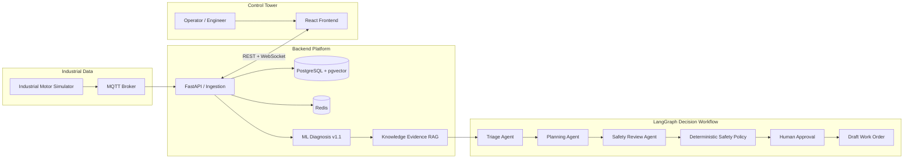

# Industrial AI Control Tower

An end-to-end Industrial AI engineering prototype for predictive maintenance, combining telemetry,
fault diagnosis, evidence-grounded RAG, multi-agent decision support, and human-in-the-loop
approval.

> Phase 6 PASS. The system supports maintenance decisions and creates draft work orders; it does
> not autonomously operate equipment or claim that physical maintenance has been completed.

## Overview

Industrial maintenance teams often have telemetry, alarms, diagnostic models, manuals, and work
management processes in separate systems. Industrial AI Control Tower connects those layers into
one traceable workflow:

```text
Telemetry
    ↓
Fault Detection
    ↓
Evidence Retrieval
    ↓
Agent Decision
    ↓
Human Approval
    ↓
Work Order
```

An industrial motor simulator publishes realistic operating and fault telemetry over MQTT. The
backend validates and stores those events, performs windowed anomaly detection and fault
classification, retrieves cited maintenance evidence, and runs a typed LangGraph workflow. A
deterministic safety policy—not an LLM—controls whether a plan is blocked, allowed, or held for a
human decision. The React Control Tower exposes the complete lifecycle over REST and WebSocket.

The platform provides an extensible adapter architecture with OPC UA and Modbus TCP simulation
support.

Industrial protocol adapters:

- MQTT (existing ingestion path)
- OPC UA (read-only)
- Modbus TCP (read-only)

## Architecture

This is the implemented Phase 1–6 path. The full component and trust-boundary model is documented
in [System Architecture](docs/architecture/SYSTEM_ARCHITECTURE.md).



## Key Features

### 1. Industrial Telemetry Platform

- Deterministic industrial motor simulator with normal, bearing wear, overload, overheating,
  misalignment, and sensor-failure scenarios
- MQTT telemetry transport with validated ingestion and idempotent persistence
- FastAPI service layer backed by PostgreSQL and Redis
- Historical REST queries plus bounded, reconnecting WebSocket telemetry streams
- Versioned Alembic migrations and isolated Docker Compose environments

### 2. Fault Diagnosis

- Window-based feature extraction, anomaly detection, and multiclass fault classification
- Frozen `diagnosis-v1.1` artifact with a validation-only threshold selection policy
- Sensor evidence, confidence, severity, model version, and trace ID persisted with each diagnosis
- Explicit `NORMAL`, `FAULT`, and `UNCERTAIN` behavior rather than unconditional classification
- One-shot blind evaluation with documented detection-delay and recovery-window limitations

### 3. Evidence RAG

- Versioned industrial maintenance corpus and reproducible ingestion pipeline
- Measured BM25, dense, hybrid RRF, and deterministic reranking alternatives
- Selected evidence carries document, section, chunk, score, and citation metadata
- Deterministic sufficiency assessment and `INSUFFICIENT_EVIDENCE` blocking
- Prompt-injection-resistant treatment of retrieved documents as untrusted evidence

### 4. Multi-Agent Decision Workflow

- Typed Triage, Planning, and Safety Review agents orchestrated by LangGraph
- Provider abstraction with strict structured outputs and bounded schema retries
- PostgreSQL checkpoints for restart and approval-resume behavior
- Deterministic `safety-policy-v1` remains authoritative over routing and approval
- Human approval, rejection, stale-plan protection, and exactly-one work-order semantics

This is **not autonomous maintenance execution**. LLM output is advisory, physical actions are
outside the Phase 6 boundary, and approved plans produce only a `DRAFT` work order.

### 5. Control Tower UI

- Fleet overview and real-time equipment monitoring
- Historical and live telemetry charts with connection-state visibility
- Incident analysis with ML, sensor, and cited knowledge evidence
- Structured agent trace without chain-of-thought exposure
- Deterministic policy review, human approval/rejection, and work-order views
- Explicit loading, empty, unavailable, stale-decision, and backend-restart states

Added Agent Observability layer for workflow tracing, metrics collection and execution analysis.

## Evaluation Results

All values below are copied from the repository's frozen or one-shot evaluation reports. They were
not recomputed for this README.

### ML — Diagnosis v1.1 blind acceptance

| Metric | Value |
|---|---:|
| Anomaly PR-AUC | 0.890698 |
| Fault classification Macro F1 | 0.914032 |
| Minimum per-class recall | 0.839623 |
| Normal false-positive rate | 1.873638% |
| Detection latency | mean 15.62 / median 14 / p95 28 ticks |

Source: [Phase 3.1 Blind Evaluation](docs/evaluation/PHASE3_1_BLIND_EVALUATION.md). The evaluation
uses synthetic scenarios; anomaly gating missed the sensor-failure scenarios in this blind set, a
documented limitation that is not hidden by the classifier metrics.

### RAG — frozen 60-query evaluation

| Metric | Selected BM25 result |
|---|---:|
| Recall@5 | 0.85 |
| MRR | 0.8617 |
| OOD rejection | 1.00 |
| Supported acceptance | 0.98 |
| False sufficient rate | 0.00 |
| Retrieval latency | p50 41.84 ms / p95 46.84 ms |

Source: [Phase 4 RAG Evaluation](docs/evaluation/PHASE4_RAG_EVALUATION.md). Results describe a
small curated corpus on one development host, not production-scale retrieval throughput.

### Agent — 30-case Real LLM Blind Gate

| Metric | Result |
|---|---:|
| Workflow success | 100.00% |
| Routing accuracy | 96.67% |
| Evidence grounding | 100.00% |
| Insufficient-evidence blocking | 100.00% |
| Prompt-injection safety | 100.00% |
| Unsupported actionable steps | 0.00% |
| Unsafe auto-pass | 0.00% |
| Terminal structured-output failures | 0 / 72 |

Source: [Phase 5 Agent Evaluation](docs/evaluation/PHASE5_AGENT_EVALUATION.md). The set was frozen
before execution and revealed once; it is retained as acceptance evidence, not a tunable benchmark.

## Tech Stack

| Area | Technology |
|---|---|
| Backend | Python 3.11, FastAPI, Pydantic, SQLAlchemy, Alembic |
| Data | PostgreSQL, pgvector, Redis, MQTT |
| AI / ML | NumPy, scikit-learn, joblib, RAG, LangGraph, structured LLM provider abstraction |
| Frontend | React, TypeScript, Vite, TanStack Query, WebSocket |
| Infrastructure | Docker, Docker Compose, GitHub Actions |
| Quality | Pytest, Vitest, Ruff, mypy, ESLint, pip-audit, npm audit |

## Demo

Copy the environment template, keep provider credentials outside Git, and start the platform:

```bash
cp .env.example .env
docker compose up
```

To include the simulator profile:

```bash
docker compose --profile demo up --build
```

The workflow is disabled by default. Real-model operation requires `WORKFLOW_ENABLED=true` and an
environment-only provider configuration; never expose provider keys through `VITE_*` variables.
See the [Demo Guide](docs/DEMO_GUIDE.md) for device registration and the complete approval flow.

## Project Structure

```text
industrial-ai-control-tower/
├── backend/              # FastAPI, ingestion, diagnosis, RAG, agents, persistence
├── frontend/             # React Control Tower
├── simulator/            # Industrial motor telemetry and fault simulation
├── ml/                   # Dataset, training, evaluation, and model artifacts
├── docs/                 # Architecture, contracts, ADRs, evaluations, demo guide
├── scripts/              # Integration and frozen-gate runners
├── infra/                # PostgreSQL and MQTT configuration
├── docker-compose.yml
└── README.md
```

## Documentation

| Document | Purpose |
|---|---|
| [System Architecture](docs/architecture/SYSTEM_ARCHITECTURE.md) | Components, data flow, trust and execution boundaries |
| [Frontend Architecture](docs/FRONTEND_ARCHITECTURE.md) | Routes, API state, WebSocket behavior, browser boundaries |
| [Control Tower UI](docs/CONTROL_TOWER_UI.md) | Operator views, evidence presentation, approval behavior |
| [Demo Guide](docs/DEMO_GUIDE.md) | End-to-end demonstration procedure |
| [ML Pipeline](docs/ML_PIPELINE.md) | Diagnosis data, training, versioning, and serving |
| [Knowledge RAG](docs/KNOWLEDGE_RAG.md) | Retrieval, citations, sufficiency, and failure contracts |
| [Multi-Agent Architecture](docs/MULTI_AGENT_ARCHITECTURE.md) | Typed workflow, checkpoints, agents, provider boundary |
| [Human Approval](docs/HUMAN_APPROVAL.md) | Interrupt/resume, identity, concurrency, exactly-once behavior |
| [Industrial Protocol Adapters](docs/INDUSTRIAL_PROTOCOL_ADAPTER.md) | Unified telemetry contract and protocol extension boundary |
| [OPC UA Adapter](docs/OPC_UA_ADAPTER.md) | Read-only simulator, node mapping, health, and security boundary |
| [Modbus TCP Adapter](docs/MODBUS_ADAPTER.md) | Read-only register mapping, simulator, health, and security boundary |
| [Evaluation Reports](docs/evaluation/) | ML, RAG, agent, blind-set, and error-analysis evidence |
| [ADRs](docs/adr/) | Architecture decisions and trade-offs |

## Verification

The Phase 6 release gate covered backend, ML, simulator, knowledge, agent, and frontend regressions;
Docker rebuild and empty-database migration; real-provider approve/reject/restart flows; static
analysis; dependency audits; and secret scanning. The final Phase 6 commit is `f41ffd3`.

Representative local checks:

```bash
cd backend && pytest
cd ../ml && pytest
cd ../simulator && pytest
cd ../frontend && npm test && npm run lint && npm run build
```

## Safety and Scope

- LLMs cannot directly control industrial equipment.
- Retrieved documents are evidence, never executable instructions.
- Deterministic policy and evidence checks can block model output.
- Risky plans require an accountable human decision.
- Work orders represent planned work, not completed physical maintenance.
- Phase 6 is complete; Phase 7 has not started.

## License

Released under the [MIT License](LICENSE).
