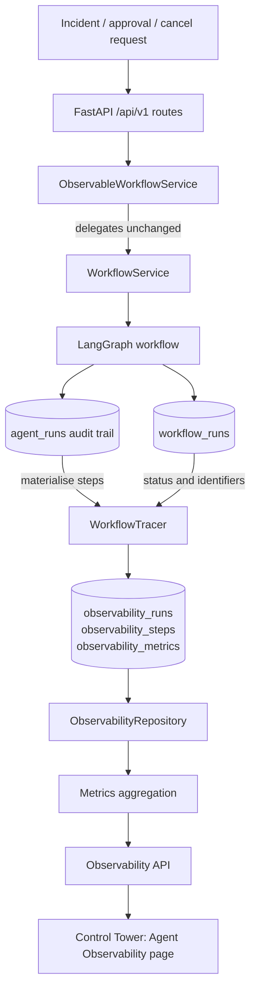
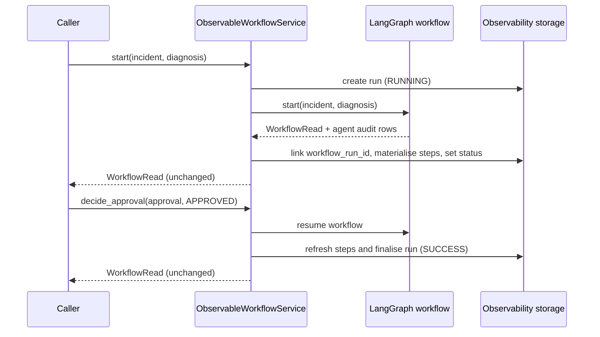

# Agent Observability

Phase 6.6 adds a read-only observability layer over the existing multi-agent maintenance
workflow. It records what the workflow already did, derives execution metrics from those
records, and exposes them to the Control Tower. It does not change how a maintenance decision
is made.

## Scope and authority

`workflow_runs` remains the single source of truth for decision state. The observability tables
store a derived projection of that execution: one row per traced run, one row per agent step,
and one row of token/latency metrics per step. Every projected step is materialised from the
Phase 5 agent audit trail in `agent_runs`; none of it is entered by hand and none of it feeds
back into the decision path.

The layer has no write access to the graph, prompts, `safety-policy-v1`, the approval flow,
work-order semantics, or retrieval behaviour. It cannot block, approve, or modify a plan.

## Architecture



`ObservableWorkflowService` extends `WorkflowService` and overrides exactly three lifecycle
methods. Everything else, including the compiled graph and the deterministic policy, is
inherited unchanged.

### Trace lifecycle



A run that fails before a `workflow_runs` row exists is still traced as `FAILED`, with
`workflow_run_id` left empty. That is the honest representation: the attempt happened, the
execution did not.

## Trace model

### `observability_runs`

| Field | Purpose |
|---|---|
| `run_id` | Observability run identifier (primary key) |
| `workflow_run_id` | Link to the authoritative `workflow_runs` row, empty for pre-start failures |
| `workflow_name` | Workflow version identifier, currently `maintenance-decision-workflow-v1` |
| `device_id` | Equipment under analysis |
| `trace_id` | HTTP correlation identifier from the originating request |
| `provider`, `model` | Agent provider identity for the execution |
| `status` | `RUNNING`, `SUCCESS`, `FAILED`, `BLOCKED`, `WAITING_APPROVAL`, `CANCELLED` |
| `start_time`, `end_time` | Run window; `end_time` stays empty while the run is open |
| `latency_ms` | Wall-clock duration for terminal runs |
| `result` | Structured outcome: workflow status, step count, work-order creation, approval decision |
| `error_message` | Failure detail when the run failed |

### `observability_steps`

One row per agent invocation, ordered by `sequence`: `agent_name`, `status`, `start_time`,
`end_time`, `latency_ms`, `input_summary`, `output_summary`, `error`, provider/model/prompt
version, and `source_agent_run_id` linking back to the audit row it was derived from.

`start_time` and `end_time` are derived from the recorded audit timestamp and the measured
latency of the real invocation. Summaries are bounded to 400 characters and contain identifiers,
counters, and validated structured output only. Prompts, retrieved document text, and model
reasoning are never stored.

### `observability_metrics`

One row per step: `input_tokens`, `output_tokens`, `total_tokens`, `latency_ms`,
`request_count`, `schema_retries`.

Token columns are `NULL` whenever the provider did not report usage. The deterministic CI
provider reports none, so its traces carry empty token fields rather than zeros. No value in
this table is estimated, back-filled, or synthesised.

### Status mapping

| Workflow status | Observability status |
|---|---|
| `CREATED`, `TRIAGING`, `TRIAGED`, `PLANNING`, `PLAN_READY`, `SAFETY_REVIEW` | `RUNNING` |
| `WAITING_APPROVAL`, `REQUIRES_APPROVAL` | `WAITING_APPROVAL` |
| `BLOCKED` | `BLOCKED` |
| `APPROVED`, `AUTO_ALLOWED`, `WORK_ORDER_CREATED`, `REJECTED` | `SUCCESS` |
| `CANCELLED` | `CANCELLED` |
| `FAILED` | `FAILED` |

`REJECTED` maps to `SUCCESS` because the workflow executed to completion and a human declined
the plan; the decision itself is preserved in `result.decision`. `CANCELLED` is kept as its own
terminal status instead of being folded into `BLOCKED`, which is reserved for deterministic
safety-policy blocks. Mixing the two would corrupt the meaning of the blocked counter.

## Metrics

### Run success rate

`success_count / completed_runs`, where a completed run is any run in a terminal status
(`SUCCESS`, `FAILED`, `BLOCKED`, `CANCELLED`). Runs that are still `RUNNING` or waiting for
approval are excluded from the denominator. The value is `null`, not `0`, when no run has
completed.

### Latency

- `avg_latency_ms`: exact average wall-clock duration of terminal runs.
- `p95_latency_ms`: nearest-rank 95th percentile over the most recent 1000 terminal runs.
- `avg_step_latency_ms`: exact average agent step latency.
- Per-agent `avg_latency_ms` and `p95_latency_ms` are reported for execution analysis.

Percentiles need the full sample set, so they are computed over a bounded recent window. The
window is ordered by start time, so the same data always yields the same figure.

### Token usage

`input_tokens`, `output_tokens`, and `total_tokens` are sums over stored steps.
`steps_with_token_data` states how many steps actually reported provider usage, and
`steps_total` how many steps exist. The Control Tower renders `Not reported` when
`total_tokens` is `null`; it never renders a synthetic zero.

### Agent step status

`step_status_counts` counts `SUCCESS` and `FAILED` steps across the whole trace store. Together
with the per-agent breakdown it distinguishes a failing agent from a failing workflow: a
`FAILED` run with no failing step is the signature of an infrastructure failure around the
graph, such as an unavailable knowledge index or checkpoint outage.

### Evaluation support

`by_agent` reports, per agent: total steps, failures, average and p95 latency, token totals, and
schema retries. Schema retries are the leading indicator of provider schema drift, so the
breakdown is usable as a regression signal for the structured-output contract without adding a
new evaluation harness.

## API

The endpoints are mounted under `/api/v1/observability` (the repository API contract namespace)
and `/api/observability` (the Phase 6.6 shorthand). Both prefixes are served by the same router.

| Endpoint | Returns |
|---|---|
| `GET /runs?limit=&status=&workflow_name=` | Recent traced runs with status, duration, step count, and token totals |
| `GET /runs/{run_id}` | Full trace: run header plus ordered agent steps with per-step latency, status, and tokens |
| `GET /metrics` | Aggregate counters, success rate, latency averages and p95, token usage, step status counts, per-agent breakdown |

`status` accepts the observability status set; anything else is rejected with `422`.
An unknown `run_id` returns `404` with code `AGENT_RUN_NOT_FOUND`.

```json
{
  "run": {
    "run_id": "1f0c0a2e-6d1f-4a3b-9e2c-5b8f0d7a41c9",
    "workflow_run_id": "8b2d1c44-0f21-4c8a-9d31-2e7a5b6c9f10",
    "workflow_name": "maintenance-decision-workflow-v1",
    "device_id": "MOTOR-001",
    "trace_id": "7c1d9e02-...",
    "provider": "openai_compatible",
    "model": "deepseek-flash",
    "status": "SUCCESS",
    "start_time": "2026-09-22T04:00:00Z",
    "end_time": "2026-09-22T04:00:02.413Z",
    "latency_ms": 2413.7,
    "step_count": 3,
    "total_tokens": 1480,
    "result": {"outcome": "SUCCESS", "step_count": 3, "work_order_created": true},
    "error_message": null
  },
  "steps": [
    {
      "step_id": "0a1b2c3d-...",
      "agent_name": "triage",
      "sequence": 0,
      "status": "SUCCESS",
      "start_time": "2026-09-22T04:00:00.100Z",
      "end_time": "2026-09-22T04:00:00.400Z",
      "latency_ms": 300.0,
      "input_summary": "agent=triage diagnosis=4d2f... requests=1",
      "output_summary": "problem_summary=Review diagnosed BEARING_WEAR condition.",
      "error": null,
      "provider": "openai_compatible",
      "model": "deepseek-flash",
      "prompt_version": "triage-prompt-v1",
      "metrics": {
        "step_id": "0a1b2c3d-...",
        "agent_name": "triage",
        "input_tokens": 320,
        "output_tokens": 48,
        "total_tokens": 368,
        "latency_ms": 300.0,
        "request_count": 1,
        "schema_retries": 0,
        "token_data_available": true
      }
    }
  ]
}
```

Agents that report no usage carry `total_tokens: null` and `token_data_available: false`; the
step remains visible with its measured latency.

## Control Tower view

The `Agent Observability` page presents four overview figures (agent runs today, success rate,
average latency with p95, token usage), a run history table, a per-run trace detail showing the
ordered agent step chain with latency, status, and token availability per step, and a per-agent
aggregation table. Selecting a run links back to the authoritative workflow view.

## Storage and configuration

- Alembic revision `20260922_05` creates `observability_runs`, `observability_steps`, and
  `observability_metrics`. No existing table is altered. The namespace is deliberate: Phase 5
  already owns a table named `agent_runs`, and reusing that name would redefine a frozen
  artifact.
- `OBSERVABILITY_ENABLED=false` disables tracing. The workflow service then runs unwrapped.
- `/ready` reports `observability` as `enabled` or `disabled`. It is informational and does not
  gate overall readiness.
- Step projections are rewritten whenever a run is re-synchronised, so re-deriving a trace is
  idempotent. Only the two observability step tables are affected.
- Tracing failures are logged and swallowed. Observability can never break a maintenance
  decision.

## Design principles

**Non-invasive observation.** The layer attaches at the service boundary and reads the audit
trail the workflow already writes. No graph node, prompt, policy rule, or retrieval function was
modified. A regression test pins the wrapper to exactly three overridden methods.

**No business logic change.** Overridden methods call the inherited implementation and pass the
result through untouched, including raised exceptions. Observability writes happen outside the
caller's transaction, and every tracing failure is contained.

**Traceability.** Each projected step carries the identifier of the audit row it came from, and
each run carries the workflow run and request trace identifiers. Any figure on the dashboard can
be traced back to a persisted record.

**Evaluation support.** Run outcomes, latency distributions, step status counts, token
availability, and schema retries are all exposed as machine-readable aggregates, so regression
checks can read them without touching the database directly.

## Limitations

- A run that has been waiting for approval and is never decided remains `WAITING_APPROVAL` and
  is excluded from the success-rate denominator. There is no automatic expiry.
- Latency percentiles are computed over the most recent 1000 terminal runs, not the complete
  history.
- Token totals are only as complete as provider reporting. Providers that omit usage produce
  empty token fields, and the dashboard says so instead of estimating.
- The layer is single-tenant and unauthenticated, consistent with the rest of the current API
  surface. Access control is a later concern.

## Verification

```bash
cd backend && pytest                          # unit and contract tests, 1 skipped without PostgreSQL
export OBSERVABILITY_TEST_DATABASE_URL="postgresql+asyncpg://postgres:<pw>@localhost:<port>/obs_phase66_test"
pytest tests/test_observability_integration.py -q
```

The integration test drives the real `WorkflowService` and the real graph against PostgreSQL in
a throwaway database, runs a workflow to `WAITING_APPROVAL`, approves it, and asserts the run,
three ordered agent steps, and the absence of fabricated token values. The database is created
and dropped by the fixture.
