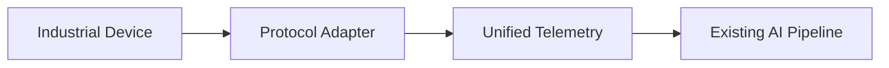

# Industrial Protocol Adapter Foundation

## Motivation

Industrial data sources expose different connection lifecycles, payload shapes, quality semantics,
and failure modes. Passing those details directly into diagnosis and workflow services would couple
the AI pipeline to every device protocol. The adapter foundation defines one boundary where a
protocol-specific sample becomes validated `UnifiedTelemetry`.

Phase 6.5-A adds the abstraction and the Simulator implementation only. The existing production
path remains unchanged:

```text
Simulator -> MQTT -> Backend ingestion -> Existing AI pipeline
```

MQTT, OPC UA, and Modbus TCP connection adapters are not implemented in this phase.

## Architecture



The adapter boundary is intentionally independent of the existing MQTT consumer. Future
integrations can normalize protocol payloads before explicitly handing them to the established
ingestion contract; Phase 6.5-A does not reroute live traffic.

## Supported Protocols

| Protocol | Status |
|---|---|
| Simulator | Implemented |
| MQTT | Planned |
| OPC UA | Planned |
| Modbus TCP | Planned |

`ProtocolType` reserves identifiers for all four protocols. A reserved identifier means the schema
can describe the source; it does not claim that a connection driver exists.

## Unified Schema

`UnifiedTelemetry` contains:

- `device_id`: source-independent equipment identity
- `timestamp`: timezone-aware timestamp normalized to UTC
- `signals`: non-empty, finite numeric measurements keyed by normalized signal name
- `source_protocol`: a `ProtocolType`, never a protocol magic string
- `quality`: `GOOD`, `UNCERTAIN`, or `BAD`
- `metadata`: protocol or source context that is not a numeric signal

The Simulator mapping currently normalizes the existing motor fields to `temperature`,
`bearing_temperature`, `vibration`, `current`, `voltage`, `rpm`, `load`, and `power`. Existing
schema version, operating state, and fault state are retained as metadata.

## Adapter Contract

`IndustrialProtocolAdapter` defines:

- `connect()`: asynchronously establish the source connection
- `disconnect()`: asynchronously release it
- `read()`: asynchronously return one `UnifiedTelemetry` sample
- `health()`: return a synchronous `AdapterHealth` snapshot

Health is explicit: `CONNECTED`, `DISCONNECTED`, or `ERROR`, with timestamps for the most recent
successful read and error. Connection, read, and configuration failures use typed adapter
exceptions rather than raw `Exception` at the boundary.

## Registry

`AdapterRegistry` maps `ProtocolType` values to adapter classes. Construction is registry-backed,
so adding a future protocol does not require an `if protocol == ...` dispatch chain:

```python
registry.register(ProtocolType.OPC_UA, OpcUaAdapter)
adapter = create_adapter("opcua", **configuration)
```

The example is illustrative; `OpcUaAdapter` is not part of Phase 6.5-A.

## Design Principles

### Protocol isolation

Protocol clients, connection state, and payload conversion stay behind the adapter contract. Core
diagnosis, RAG, agent, safety, and frontend logic remain unchanged.

### Unified schema

Downstream integrations receive validated protocol-neutral telemetry and explicit quality instead
of interpreting vendor payloads.

### Extensibility

New implementations register against `ProtocolType`. The registry rejects duplicates, unknown
protocols, and invalid construction parameters with `AdapterConfigurationError`.

## Device Configuration Example

[`configs/devices.example.yaml`](../configs/devices.example.yaml) documents a credential-free
Simulator device and its signal units. It is an example only; Phase 6.5-A does not add a YAML loader
or change runtime configuration.
