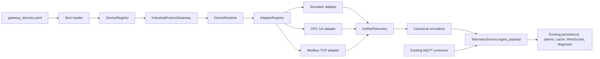

# Industrial Protocol Gateway

## Motivation

Phase 6.5 built a complete adapter layer for four industrial protocols, and Phase 6.5's
own documentation recorded the deliberate boundary it left in place:

> The adapter boundary is intentionally independent of the existing MQTT consumer.
> Future integrations can normalize protocol payloads before explicitly handing them
> to the established ingestion contract.

Phase 6.7 is that integration. Before this phase the adapters were unreachable from the
application: `create_adapter` was only ever called from the adapter test suite, and
`UnifiedTelemetry` was never consumed anywhere under `app/`. The gateway gives the
adapters a runtime owner, and it does so without introducing a second ingestion path.

## Architecture



The dashed, load-bearing detail is that the gateway and the MQTT consumer converge on the
same function, `TelemetryService.ingest_payload`. There is no gateway-specific persistence,
no gateway-specific deduplication, and no gateway-specific fan-out.

## Device definition

A device definition is declarative and strictly validated. Unknown keys, unknown protocol
blocks, unsupported configuration versions, and protocol/block mismatches are rejected with
a precise message rather than ignored.

```yaml
version: 1
devices:
  - device_id: MOTOR-002
    protocol: modbus_tcp      # mqtt | opc_ua | modbus_tcp | simulator
    enabled: true
    poll_interval_ms: 1000
    state:
      operating_state: RUNNING
      fault_state: NORMAL
    modbus_tcp:
      host: localhost
      port: 5020
      unit_id: 1
      timeout_seconds: 3.0
      registers:
        temperature: { address: 40001, scale: 0.1, unit: celsius }
        bearing_temperature: { address: 40002, scale: 0.1, unit: celsius }
        vibration: { address: 40003, scale: 0.01, unit: mm_s }
        current: { address: 40004, scale: 0.01, unit: ampere }
        voltage: { address: 40005, scale: 0.1, unit: volt }
        rpm: { address: 40006, scale: 1, unit: rpm }
        load: { address: 40007, scale: 0.1, unit: percent }
        power: { address: 40008, scale: 0.01, unit: kilowatt }
```

See [`configs/gateway_devices.example.yaml`](../configs/gateway_devices.example.yaml) for all
four protocols. `configs/devices.example.yaml`, `configs/modbus_devices.example.yaml` and
`configs/opcua_devices.example.yaml` document raw adapter constructor inputs at the adapter
layer and are a different concern.

### Why signal coverage is mandatory

A polled device must map all eight canonical signals. This is not a stylistic choice; it
follows from the contract the gateway reuses:

- Every signal column on the `telemetry` table is `nullable=False`.
- `TelemetryIn` declares all thirteen fields as required and forbids extras, and
  `test_backend_and_simulator_field_contract_match` pins its field set to the simulator's
  `Telemetry` model.
- Alarm rules and the ML feature path read the canonical fields directly.

A device that cannot supply all eight signals therefore cannot be ingested without
fabricating measurements. The gateway rejects the definition at load time and names the
missing signals. It never writes a default, a zero, or an interpolation.

### Why state labels come from configuration

`operating_state` and `fault_state` are strings. `UnifiedTelemetry.signals` is
`dict[str, float]`, `OpcUaAdapter` rejects non-numeric node values, and Modbus registers are
numeric by definition. No adapter can emit these two fields, so the only honest source is
the device definition. Both labels are required.

Optional `derived` rules may override a label using a real measurement:

```yaml
    state:
      operating_state: RUNNING
      fault_state: NORMAL
      derived:
        - target: fault_state
          signal: vibration
          operator: gt        # eq | ne | gt | gte | lt | lte
          threshold: 7
          then: HIGH_VIBRATION
```

Rules are evaluated in declaration order, the first matching rule per target wins, and each
target is resolved independently. A target with no matching rule keeps its configured label.
A rule referencing a signal that the sample does not carry is skipped.

Derived labels are computed from measured values, so they are a classification of real data
rather than a substitute for it.

## Lifecycle

| State | Meaning |
|---|---|
| `DISABLED` | `enabled: false`. No task, no connection. |
| `STARTING` | Task created, registration not yet verified. |
| `CONNECTING` | `adapter.connect()` in flight. |
| `CONNECTED` | Last read and ingestion succeeded. |
| `DEGRADED` | Consecutive failures reached `failure_threshold`; still polling. |
| `RECONNECTING` | Consecutive failures reached `reconnect_threshold`; in bounded backoff. |
| `ERROR` | Terminal for this runtime, with a stated reason. |
| `STOPPED` | Stopped gracefully after a `stop`, or never started. |

`ERROR` is reached when the device is not registered in the `devices` table, when the adapter
cannot be constructed, when no simulator source is available, or when reconnection attempts
are exhausted. Recovery is an explicit operator action: `POST /api/v1/connectivity/devices/{id}/start`.

Backoff is bounded exponential (`initial × factor^attempt`, clamped to `max`) and deliberately
carries no jitter, so an operator can observe the exact schedule and tests are reproducible.

### Failure isolation

Each device owns one asyncio task and one adapter. A device that cannot register, cannot
connect, cannot read, or produces samples the ingestion contract rejects moves through
`DEGRADED` and `RECONNECTING` on its own. No other device's polling is affected, and an
unexpected exception inside one runtime is converted into that runtime's `ERROR` state
rather than propagating into the application.

### Graceful shutdown

`gateway.stop()` cancels every runtime task, awaits each teardown, and disconnects every
adapter. The application lifespan awaits it before closing Redis and the database.

## MQTT keeps push semantics

An `mqtt` device is an inventory entry only. The gateway never polls it and never constructs
an adapter for it; it is not registered in the adapter registry. Its state mirrors the shared
consumer's connection instead, so such a device reads `CONNECTED` or `DEGRADED` rather than
reporting a connection it does not own. Telemetry continues to arrive through the existing
MQTT consumer, unchanged.

## Connectivity API

Every route is mounted twice: `/api/v1/connectivity/*` and `/api/connectivity/*`.

| Method | Path | Purpose |
|---|---|---|
| `GET` | `/connectivity/summary` | Availability, inventory counts, state histogram, ingestion totals |
| `GET` | `/connectivity/devices` | Every device and its current state |
| `GET` | `/connectivity/devices/{device_id}` | One device's state, counters, and last error |
| `POST` | `/connectivity/devices/{device_id}/start` | Start polling for one device |
| `POST` | `/connectivity/devices/{device_id}/stop` | Stop polling for one device |

There is no endpoint that writes to a device. `start` and `stop` toggle the gateway's own
polling runtime; no route in this phase can command plant equipment. Configuration also
contains no write capability: every adapter in the registry is read-only.

## Secrets

No device definition in this phase carries credentials, because every adapter is read-only
and unauthenticated. `redact_secrets` exists so that future credential-bearing fields cannot
leak through the connectivity API or logs: any key containing `password`, `passwd`, `secret`,
`token`, `credential`, `api_key`, `apikey` or `private_key` is replaced with `***REDACTED***`
before the document is emitted. The connectivity API returns only device id, protocol,
lifecycle state, counters, timestamps, and a non-secret endpoint description.

## Configuration

| Setting | Default | Meaning |
|---|---|---|
| `GATEWAY_ENABLED` | `false` | Load and run the gateway |
| `GATEWAY_CONFIG_PATH` | `configs/gateway_devices.yaml` | Device definition file |
| `GATEWAY_FAILURE_THRESHOLD` | `3` | Consecutive failures before `DEGRADED` |
| `GATEWAY_RECONNECT_THRESHOLD` | `6` | Consecutive failures before `RECONNECTING` |
| `GATEWAY_MAX_RECONNECT_ATTEMPTS` | `5` | Backoff attempts before `ERROR` |
| `GATEWAY_BACKOFF_INITIAL_SECONDS` | `1.0` | First backoff interval |
| `GATEWAY_BACKOFF_MAX_SECONDS` | `30.0` | Backoff ceiling |

The gateway is disabled by default, matching `WORKFLOW_ENABLED`. When enabled it appears in
`/ready` as a dependency; when disabled it reports `disabled` and does not affect readiness.

## No migration

The gateway is configuration-driven. It adds no tables and changes no schema, so this phase
adds no Alembic revision and `alembic check` remains clean.

## Limitations

These are deliberate and stated rather than hidden:

1. **Protocol and quality are not persisted.** `UnifiedTelemetry` carries `source_protocol`
   and `quality`, but the canonical contract has no field for either and forbids extras. The
   protocol is visible through the connectivity API; `quality` is currently discarded.
2. **Device status is process-local.** State and counters live in memory and reset on restart.
   Nothing is persisted.
3. **`ERROR` requires a manual restart.** There is no supervised retry from `ERROR`.
4. **Devices must pre-exist.** The gateway verifies registration and never creates device rows.
   Onboarding is a configuration change plus a `devices` table entry.
5. **Simulator sources must be injected.** The backend runtime image does not ship the
   simulator package, so a simulator device reports `ERROR` unless the application injects a
   source factory.
6. **Full signal coverage is a precondition.** Devices exposing a subset of the canonical
   contract cannot be onboarded until that contract is widened, which would touch the
   ingestion schema, alarm rules, ML features, and the frontend types.

## Testing

`backend/tests/gateway/` covers definition validation, strict loading, redaction, registry
atomicity, normalization and state derivation, the full lifecycle, retry exhaustion, failure
isolation, graceful shutdown, MQTT passivity, simulator integration, and the HTTP surface.

Two tests in `test_normalizer.py` are equivalence checks against the real ingestion
boundary: the generated payload must validate as `TelemetryIn`, and the generated topic must
parse back to the same device id through `TelemetryService._topic_device_id`. Those tests fail
if the gateway ever drifts away from the contract it reuses.
