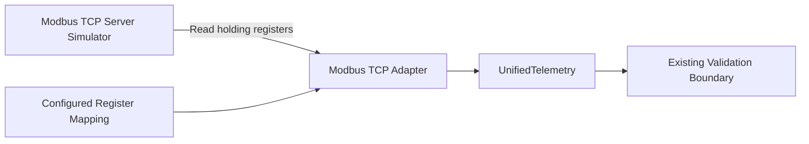

# Modbus TCP Adapter

## Overview

Modbus TCP is commonly used to expose PLC and industrial-device register data over Ethernet. Phase
6.5-C adds a deterministic development server and a read-only asynchronous adapter that converts
configured holding registers into the existing `UnifiedTelemetry` model. The integration is for
telemetry acquisition only and does not alter MQTT ingestion, diagnosis, RAG, agent workflows, or
the safety policy.

The backend and simulator pin `pymodbus==3.15.0`. The fixed version provides the asynchronous TCP
client and server APIs used by the adapter while preventing unreviewed API changes from entering
the build.

## Architecture

The simulator exposes deterministic raw values. The Adapter owns connection state, protocol
address conversion, scaling, and normalization; downstream code receives protocol-neutral data.

## Register Mapping

| Address | Signal | Raw Value | Scale | Normalized Value |
|---|---|---:|---:|---:|
| 40001 | Temperature | 685 | 0.1 | 68.5 |
| 40002 | Current | 1240 | 0.01 | 12.4 |
| 40003 | Vibration | 710 | 0.01 | 7.1 |
| 40004 | RPM | 1480 | 1 | 1480 |
| 40005 | Load | 720 | 0.1 | 72.0 |

The mapping is defined outside business logic in
[`configs/modbus_devices.example.yaml`](../configs/modbus_devices.example.yaml). Conventional
holding-register number 40001 maps to protocol offset 0; subsequent addresses are converted using
the same rule. Signal name, address, scale, and unit all come from configuration.

## Adapter Lifecycle and Health

`ModbusTcpAdapter` implements the shared asynchronous `connect()`, `read()`, and `disconnect()`
contract. `health()` reports:

- `CONNECTED` after a successful TCP connection
- `DISCONNECTED` before connection and after a clean disconnect
- `ERROR` after a connection or register-read failure
- `host`, `port`, `last_success`, `last_error`, and a bounded status message

Connection and read failures are translated into the existing typed adapter exceptions.

## Security Boundary

The Modbus adapter is designed for telemetry acquisition only.

Supported:

- Read configured holding-register telemetry
- Scale numeric register values into `UnifiedTelemetry`
- Report connection and read health

Not supported:

- Register or coil writes
- PLC control
- Device-state changes
- Commands or remote method execution

The simulator datastore is marked read-only, and the Adapter exposes no control API. The example
uses loopback and contains no credentials or production endpoints.

## Protocol Status

| Protocol | Status |
|---|---|
| Simulator | PASS |
| MQTT | PASS (existing ingestion path) |
| OPC UA | PASS (read-only simulation) |
| Modbus TCP | PASS (read-only simulation) |

## Test Usage

The integration tests bind the server to an ephemeral loopback port, establish a real asynchronous
Modbus TCP session, read holding register 40001, validate configured scaling and
`UnifiedTelemetry`, verify lifecycle health, and shut the server down. The simulator is not added
to the production compose runtime.
