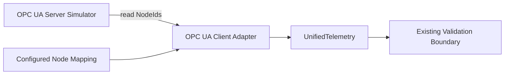

# OPC UA Adapter

## Overview

OPC UA is used here as a read-only industrial telemetry source. Phase 6.5-B adds a deterministic
development server and an `asyncua` client adapter that converts configured motor nodes into the
existing `UnifiedTelemetry` contract. It does not alter the existing MQTT ingestion path or connect
OPC UA directly to diagnosis, RAG, or agent workflows.

The backend and simulator pin `asyncua==2.0.1` as the single OPC UA dependency.

## Architecture

The server exposes deterministic telemetry under `Objects/MOTOR-001`. The adapter owns protocol
connection state and value normalization; downstream code only sees the protocol-neutral model.

## Node Mapping

Node selection is configuration-driven. The adapter does not embed device NodeIds:

| Signal | Example NodeId |
|---|---|
| `temperature` | `ns=2;s=MOTOR-001/Temperature` |
| `vibration` | `ns=2;s=MOTOR-001/Vibration` |
| `current` | `ns=2;s=MOTOR-001/Current` |
| `rpm` | `ns=2;s=MOTOR-001/RPM` |
| `load` | `ns=2;s=MOTOR-001/Load` |

The credential-free mapping example is
[`configs/opcua_devices.example.yaml`](../configs/opcua_devices.example.yaml). Each configured
signal becomes a numeric entry in `UnifiedTelemetry.signals`; the endpoint and resolved NodeIds are
retained as metadata. A successful sample uses `source_protocol: opc_ua` and `quality: GOOD`.

## Adapter Lifecycle and Health

`OpcUaAdapter` implements the shared asynchronous `connect()`, `read()`, and `disconnect()`
contract. `health()` reports:

- `CONNECTED` after a successful connection and while reads are available
- `DISCONNECTED` before connection and after a clean disconnect
- `ERROR` after a connection, read, or disconnect failure
- `last_success`, `last_error`, a bounded message, and the configured endpoint

Connection and read failures are translated to the existing typed adapter exceptions. Third-party
client exceptions do not leak across the adapter boundary.

## Security Boundary

This implementation is a **read-only simulation adapter**.

- Server variables keep the OPC UA library's default read-only access level.
- The adapter only reads configured node values.
- No write API, writable node, OPC UA method, control command, or command execution path exists.
- The example configuration contains no credentials or production endpoints.

It must not be interpreted as authorization to control a PLC or physical device.

## Protocol Status

| Protocol | Status |
|---|---|
| Simulator | PASS |
| MQTT | PASS (existing ingestion path) |
| OPC UA | PASS (read-only simulation) |
| Modbus TCP | PASS (read-only simulation) |

## Local Test Usage

The integration tests start the server on an ephemeral loopback port, establish a real OPC UA
client session, read deterministic values, validate `UnifiedTelemetry`, verify health transitions,
and stop the server. The server is not started by the production compose stack.
