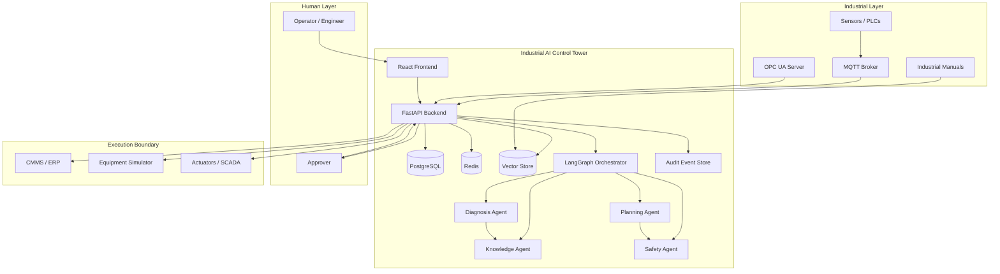
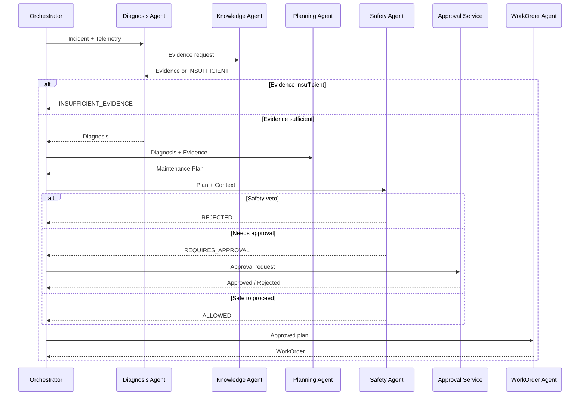

# System Architecture

## System Goal

Industrial AI Control Tower is a multi-agent AI decision platform for industrial equipment operation and maintenance. It combines real-time monitoring, anomaly detection, fault diagnosis, industrial knowledge retrieval, multi-agent collaboration, safety review, human approval, and work-order execution into one auditable closed-loop system.

The ultimate goal is not to replace operators, but to augment them with evidence-based recommendations and enforce deterministic safety boundaries before any action reaches physical equipment.

## Context

Industrial facilities already have sensors, SCADA systems, and maintenance records. The platform sits above these systems as a decision support layer:

- It consumes telemetry, alarms, and events from existing industrial systems.
- It stores structured domain data and unstructured industrial knowledge.
- It uses AI agents to diagnose anomalies, retrieve evidence, plan maintenance, and propose work orders.
- It enforces a human-in-the-loop approval model before any executable action is dispatched.
- It produces an audit trail for every significant decision.

## Components

### Frontend

- React + TypeScript + Vite
- Displays device status, alarms, incidents, diagnoses, approvals, and work orders
- Communicates with backend via REST and WebSocket

### Backend

- FastAPI API and WebSocket layer over focused services and repositories
- Async SQLAlchemy/asyncpg, Redis asyncio, and aiomqtt share one non-blocking event-loop strategy
- Domain services own device lifecycle, telemetry ingestion, deterministic alarms, and audit events
- Repositories isolate PostgreSQL queries; Pydantic schemas remain separate from ORM models
- The API boundary is ready for later RBAC dependencies, but Phase 2 deliberately has no OAuth/SSO

#### ML Diagnosis Engine (Phase 3)

Persisted telemetry feeds a bounded per-device window. Every configured stride, a versioned
feature extractor validates 20 samples and computes 76 numeric features without label fields. A
validation-selected robust anomaly detector gates a calibrated Random Forest classifier. Low
confidence becomes `UNCERTAIN`; extraction or inference exceptions become persisted `FAILED`
records. Severity and the three strongest sensor deviations accompany each result.

Training lives under `ml/` and never runs in the backend. Serving loads only a frozen joblib
artifact after SHA-256, model, feature, telemetry-schema, and library-version checks. On restart,
the buffer is warmed from recent PostgreSQL telemetry. See
[`ML_PIPELINE.md`](../ML_PIPELINE.md).

### Agent Orchestrator

- LangGraph workflow engine
- Coordinates Diagnosis, Knowledge, Planning, Safety, and WorkOrder agents
- Maintains run state, handles retries, timeouts, and failure semantics

### Data Layer

- PostgreSQL: primary persistence for domain entities
- Redis: caching, session state, task queues, rate limiting
- Vector Store: industrial knowledge embeddings (Phase 4+)
- Audit/Event Storage: immutable log of agent actions and human decisions

In Phases 2–3, PostgreSQL is authoritative and Alembic owns the schema. Redis contains only
rebuildable latest telemetry. See [`DATA_PLATFORM.md`](../DATA_PLATFORM.md) and
[`INGESTION_PIPELINE.md`](../INGESTION_PIPELINE.md).

### Industrial Integration

- MQTT: lightweight telemetry ingestion
- OPC UA: structured industrial data access
- Equipment Simulator: offline validation and synthetic data generation

#### Equipment Simulator (Phase 1)

The simulator generates synthetic telemetry for an `IndustrialMotor` and publishes it to the MQTT broker. It is decoupled from transport via the `TelemetryPublisher` interface and supports deterministic seeds, configurable fault injection, and structured logging. See [`docs/SIMULATOR.md`](../SIMULATOR.md) for details.

### Observability

- Structured logging
- Prometheus metrics
- OpenTelemetry traces
- Grafana dashboards

## Data Flow

1. Telemetry arrives via MQTT or OPC UA.
2. Backend normalizes telemetry and evaluates alarm rules.
3. Alarms may spawn Incidents when they exceed thresholds or correlate across devices.
4. The Orchestrator receives an Incident and invokes the Diagnosis Agent.
5. The Diagnosis Agent may call the Knowledge Agent for evidence retrieval.
6. If evidence is insufficient, the workflow returns `INSUFFICIENT_EVIDENCE`.
7. If evidence is sufficient, the Planning Agent proposes a Maintenance Plan.
8. The Safety Agent evaluates the plan against deterministic policies.
9. If the Safety Agent vetoes, the workflow returns `REJECTED`.
10. If the plan requires human approval, it enters the Approval Queue.
11. Upon approval, the WorkOrder Agent generates a work order.
12. The work order is dispatched to the CMMS or execution boundary.
13. Results and feedback are recorded and fed back into the knowledge base.

## Agent Flow

## Trust Boundaries

The system defines four trust boundaries:

1. **External Industrial Layer**: Untrusted data sources. All incoming telemetry is validated and normalized.
2. **Platform Boundary**: Authenticated and authorized access only. Secrets never leave this boundary in plain text.
3. **Agent Boundary**: LLM outputs are treated as recommendations, not commands.
4. **Execution Boundary**: Physical actions or CMMS mutations occur only after deterministic safety and human approval gates.

## Human-in-the-Loop

Human approval is mandatory for any action that:

- Modifies equipment state
- Dispatches a maintenance work order
- Overrides a safety policy
- Updates a critical configuration

Approval requests include:

- Incident context
- Diagnosis and evidence
- Proposed plan
- Safety evaluation
- Risk level

Approvers can approve, reject, or request additional evidence.

## Safety Boundary

Safety is enforced by a combination of:

- **Deterministic Policy Engine**: Hard rules that cannot be overridden by LLM output.
- **Safety Agent**: Validates plans against policies and known hazardous states.
- **Human Approval**: Required for high-risk actions.
- **Execution Boundary**: The only layer that can issue commands to external systems.

LLMs are never given direct access to actuators, CMMS write APIs, or SCADA control points.

## Failure Boundary

Failures are explicit and observable. The system uses a uniform set of status values:

- `SUCCESS`
- `FAILED`
- `TIMEOUT`
- `RETRYING`
- `BLOCKED`
- `NOT_RUN`
- `INSUFFICIENT_EVIDENCE`
- `REQUIRES_APPROVAL`
- `REJECTED`

All exceptions are logged and traced. Silent catch blocks are prohibited.
